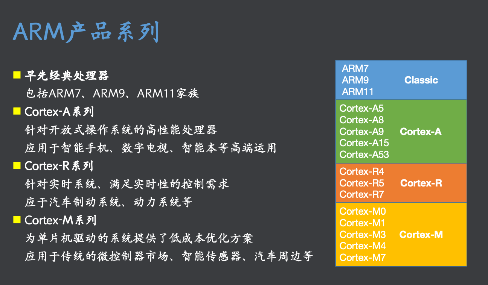
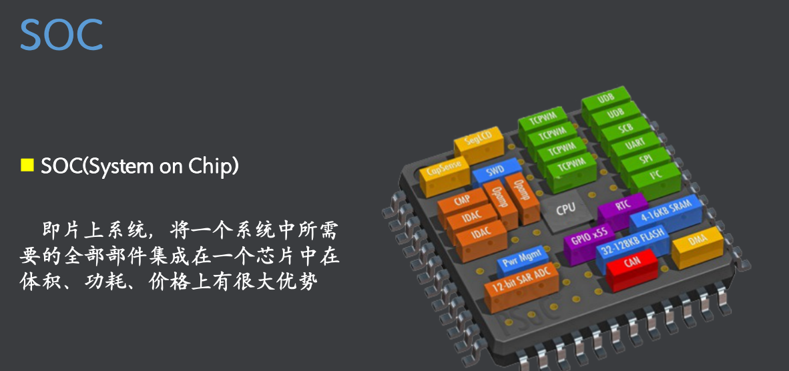
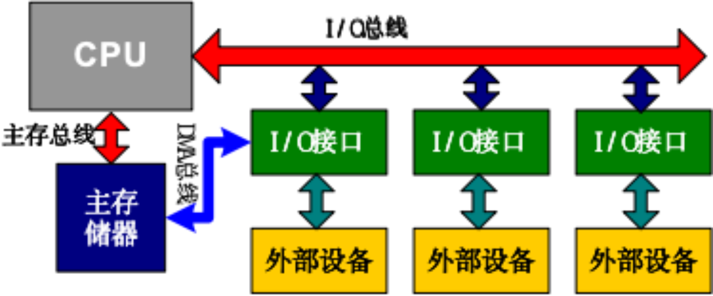
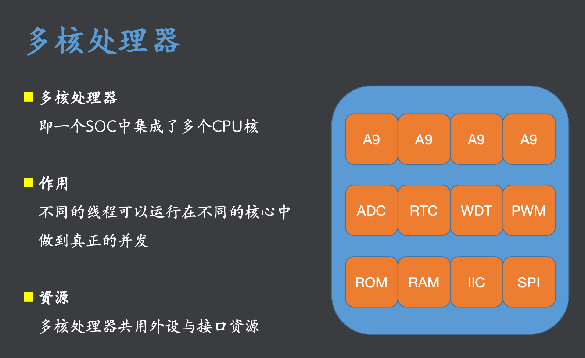

### 操作系统
- 进程管理
- 内存管理
- 文件系统
- 设备管理
- 网络协议

### 课程体系
- Arm 
- linux系统移植
- 驱动开发

## Arm体系结构

- 对于编译器，常常使用以下术语
- arm一般指32位处理器.
- aarch64 表示64位构架的arm
- armv8: armv8是首个支持64的arm构架，也就用于表示aarch64，但是为啥编译出来是32的呢？
- - 可能同时支持32和64.
- arm-unknown-linux-gnueabihf: hf表示Hardware Floating-Point,表示指令支持浮点。
<font color=red>
- glibc:Unix-like的标准C库之一,除了提供标准C库函数外，glibc还提供了一些GNU扩展函数，以及对POSIX标准的实现.
- uClibc:（Micro C Library）是一个精简的C语言库，专为嵌入式系统和嵌入式Linux系统设计
</font>
## 学习列表
- [存储模式](存储模式.md)
- [工作模式](工作模式.md)
- [寄存器](寄存器.md)
- [异常机制](异常机制.md)
- [流水线]()
- [指令集](指令集.md)



## 接口技术
- GPIO
- PWM
- UART
- ADC
- RTC
- IIC

## 计算机体系构架

- DMA总线（蓝色）：物理实现，可以不经过CPU让外设访问主存储器
- CPU执行分为： 1.取指，2.译码，3.执行三个过程。


## Arm指令流水线
- 指令的执行分 1.取指(F)，2.译码(D)，3.执行()三个过程。
- 三级流水线结构

```
t:
三级流水线
    1   2   3   4   5   6   7   8   9
    F   D   E   F   D   E   F   D   E
        F   D   E   F   D   E   F   D
            F   D   E   F   D   E   F
t:
    一级流水线
    1   2   3   4   5   6   7   8   9
    F   D   E   F   D   E   F   D   E


在 t=6的时刻

一级流水线完成：指令1，指令2的执行
三级流水线完成：指令1，指令2的执行，
            +指令3的执行
            +指令4的执行
            +指令5的取指，译码
            +指令6的取指
```


- ARM7采用3级流水线,ARM9采用5级流水线,Cortex-A9采用8级流水线
- 虽然流水线级数越来越多，但都是在三级流水线的基础上进行了细分
- <font color=red>PC指针永远指向取值的指令,而正在执行的指令一定是 PC指令之前的2个指令，执行地址是PC-8</font>
- 跳转，上电的前两个周期,都可能造成流水线不能形成。

