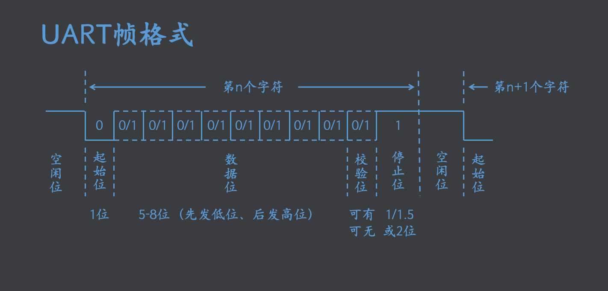
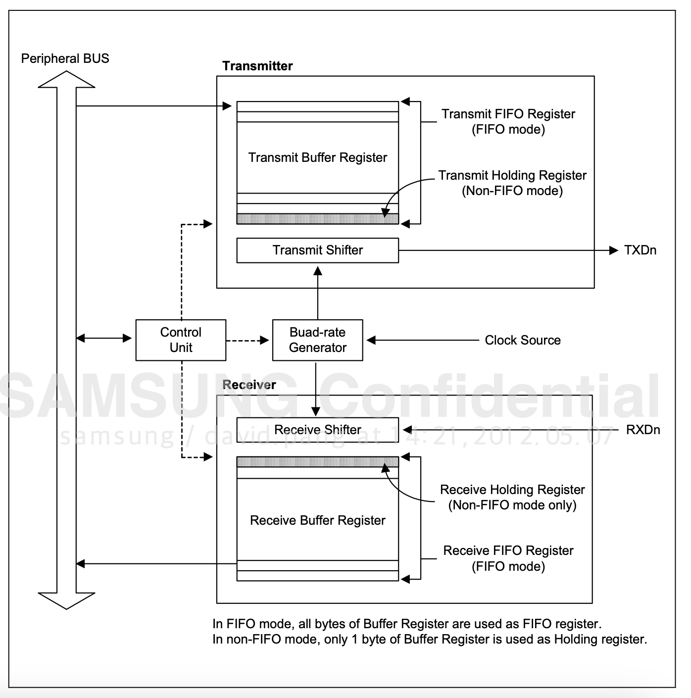
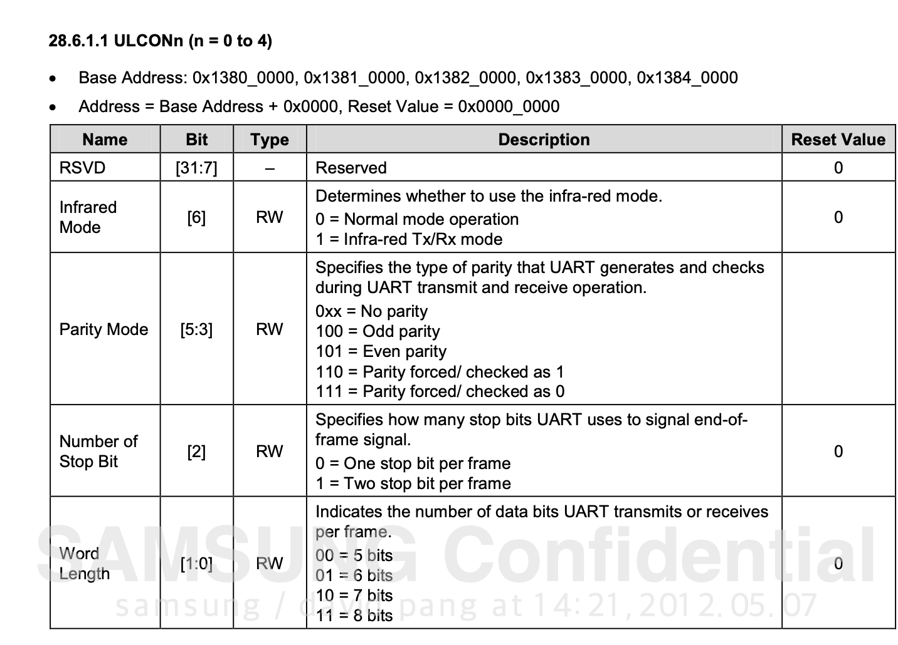

## 通信基础 - 并行和串行

## 单工和双工

## 传输数据帧


-  空闲位：高电平
-  起始位：低电平
- 一次只可以传输： 5-8位
- 先传低位，后传高位
- 停止位：1
- 更多过程需要重复此过程
- 接收端通过沟通好的波特率(bps)，掐时间解析传输bit,
- 以上所有过程都 在UART控制器中 实现了


## 需要配置的现象
- 传输位数
- 波特率
- 是否使用校验
- 停止位多少bit

## 4412中uart工作原理

```
The Baud-rate generator uses SCLK_UART. The transmitter and the receiver contain FIFOs and data shifters. The data to be transmitted is written to Tx FIFO, and copied to the transmit shifter. The data is then shifted out by the transmit data pin (TxDn). The received data is shifted from the receive data pin (RxDn), and copied to Rx FIFO from the shifter.

```
- SCLK_UART时钟，100M
- transmitter： FIFOs ，data shifters，FIFO->shifter数据拷贝
- receiver FIFOs ，data shifters，shifer->FIFO数据拷贝
- TXDn：发生引脚
- RXDn：接收引脚



