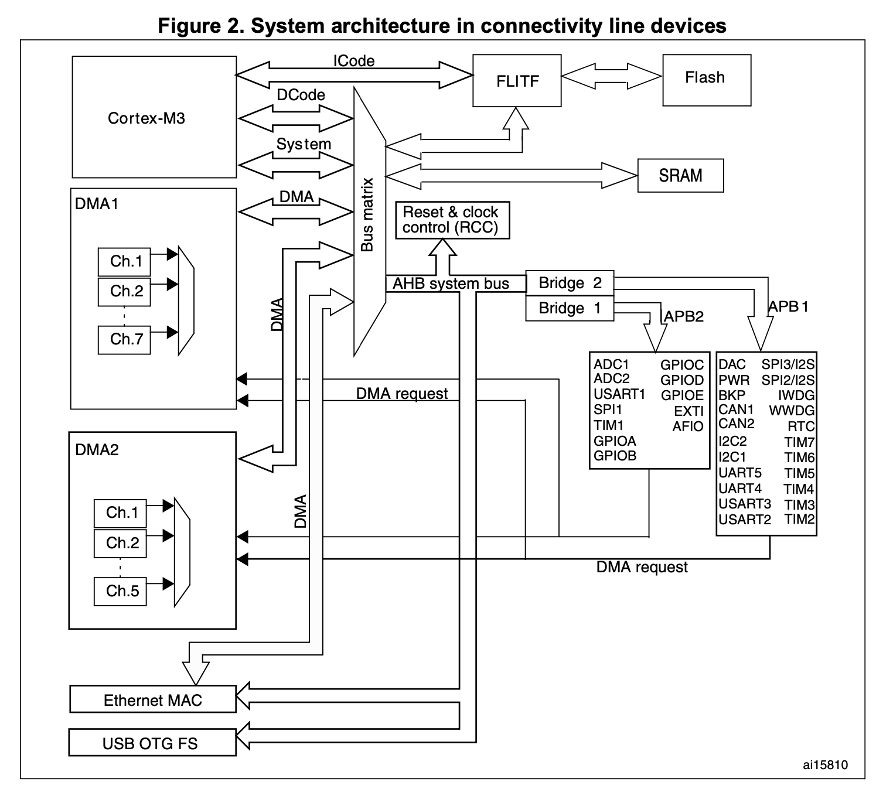
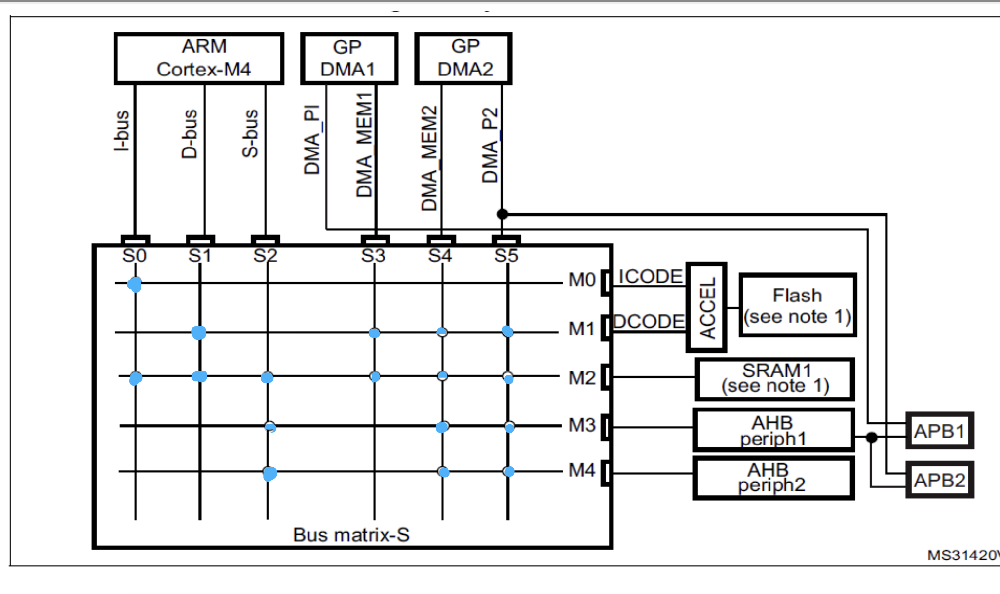
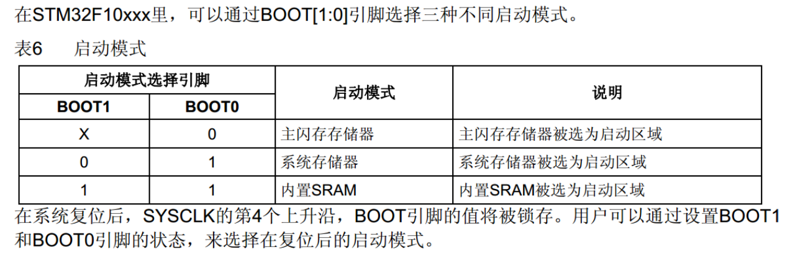

- ICode:指令总线， 连接Flash的指令接口。
- DCode:指令总线， 连接Flash的数据接口。
- 总线矩阵:  协调左侧的（DCode,DMA）与右侧的（SRAM,AHB,FLASH）的通信。
- - 驱动单元：DBus,SBus,DMA1,DMA2,网卡DMA
- - 被动单元: SRAM,AHB2APB桥，FLITF(Flash接口)。

- DMA控制器：DMA1,DMA2
- AHB(Advanced High-performance Bus):高带宽
- APB1(APB (Advanced Peripheral Bus):APB1(36MHz),APB2(72MHz):简单的接口


```
+-------------------+
|       CPU         |
+-------------------+
         |
         v
+-------------------+
|        AHB        |
+-------------------+
         |
         v
+-------------------+    +-------------------+
|   AHB-APB Bridge  |--->|        APB        |
+-------------------+    +-------------------+
```


## 程序启动
- 1.上电复位
- 2.Boot ROM 选择启动模式（Flash / System Memory / SRAM）
- - *0-> flash启动: flash数据读入 System Memory ，然后执行？
- - 01-> System Memory ？
- - 11:  sram启动

- 3.如果从 Flash 启动：
- - 读取向量表
- - 跳转 Reset_Handler
- - 执行 SystemInit() 配置时钟
- - 初始化 C 运行环境
- - 进入 main() 运行用户代码
[mystartup.s](data/mystartup.s)