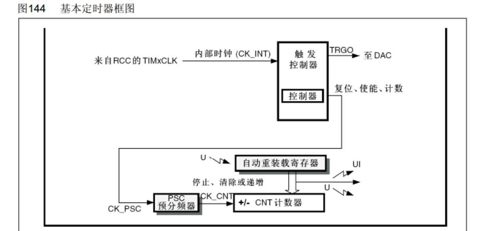
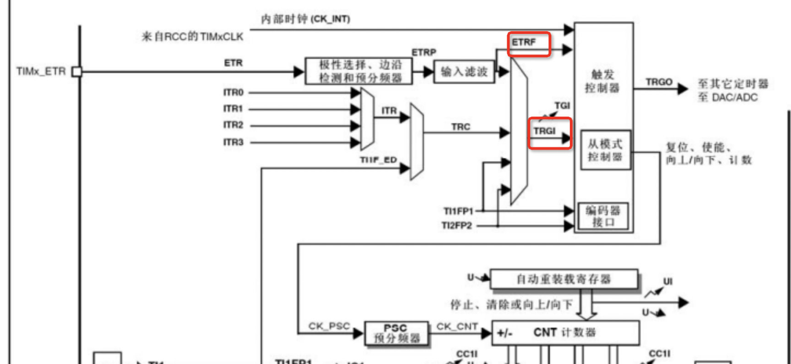
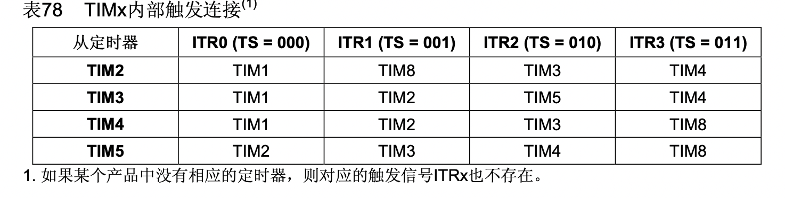
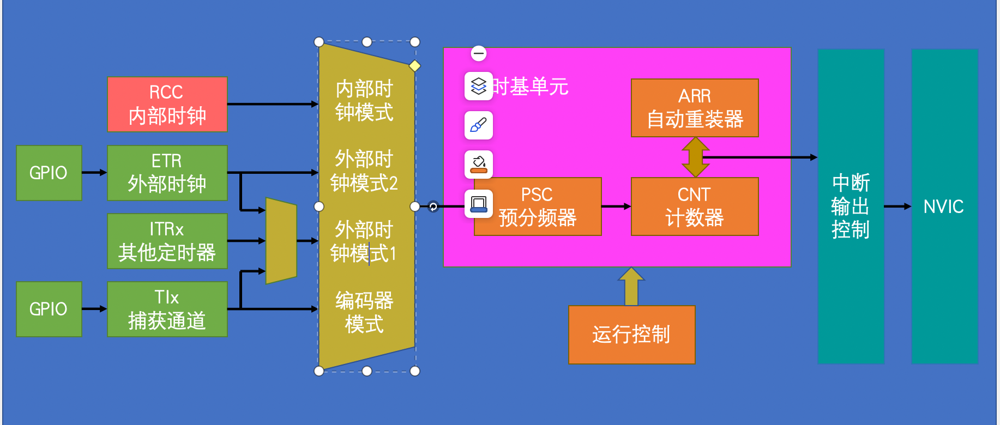

# STM32 Timer 学习方案

## 1. 基础知识
### 1.1 定时器的分类
- 基本定时器（如 TIM6、TIM7）:APB1总线
- 通用定时器（如 TIM2、TIM3、TIM4、TIM5）:APB1总线
- 高级定时器（如 TIM1、TIM8）:APB2总线

### 1.2 定时器的主要功能
- 时钟源选择
- 定时中断
- 输入捕获
- 输出比较
- PWM（脉宽调制）输出
- 编码器模式

---

## 1.3 定时器对应的寄存器
定时器的功能通过一系列寄存器来实现，以下是常见的定时器寄存器及其作用：

- **控制寄存器（CR1, CR2）**: 用于配置定时器的基本功能，如计数器使能、对齐模式、方向等。
- **状态寄存器（SR）**: 用于指示定时器的状态，如中断标志位。
- **事件生成寄存器（EGR）**: 用于手动触发事件，如更新事件、捕获/比较事件。
- **计数器寄存器（CNT）**: 用于存储当前计数值。
- **预分频器寄存器（PSC）**: 用于设置定时器的时钟分频系数。
- **自动重装载寄存器（ARR）**: 用于设置计数器的目标。
- **捕获/比较寄存器（CCR1, CCR2, CCR3, CCR4）**: 用于存储捕获值或比较值。
- **中断使能寄存器（DIER）**: 用于配置定时器的中断源。

这些寄存器的配置决定了定时器的具体行为，如定时中断的频率、PWM输出的占空比等。

## 基本定时器
### 基本定时器的原理图

基本定时器（如 TIM6 和 TIM7）是 STM32 中最简单的定时器，主要用于生成定时中断或事件。以下是基本定时器的原理图示意：

#### 工作流程
1. **时钟源 (CLK_INT)**: 系统内部时钟信号，72MHZ。
2. **预分频器 (CK_PSC)**: 对时钟信号进行分频，生成计数器的输入时钟。
3. **计数器 (CNT)**: 根据输入时钟递增或递减计数。
4. **自动重装载寄存器 (ARR)**: 设置计数器的最大值，当计数器达到该值时会产生【更新事件或更新中断】。
5. **更新中断**: 触发用于执行用户定义的【定时任务中断函数】。
6. **更新事件**：把UIF映射到TRGO信号(triger out)，作为其他设备的输入:eg:主模式触发DAC。
#### 特点
- 不支持输入捕获、输出比较等高级功能。

## 通用定时器

### 通用定时器的时钟源选择电路原理图
通用定时器（如 TIM2、TIM3、TIM4、TIM5）支持多种时钟源选择，以下是其时钟源选择电路的原理图示意：

#### 工作流程
1. **内部时钟 (CK_INT)**: 同基本定时器，72MHZ
2. **外部时钟 (ETR)**: 也称为【外部时钟模式2】，从外部引脚输入的时钟信号，经过配置和滤波电路后才进入MUX。
3. **外部时钟模式1 (TRGI)**: 
-  **从模式时钟 (ITR)**: 从其他定时器的触发信号(TRGO)作为时钟源，实现定时器之间的联动。
-  **输入捕获 (ICx)**: 可通过输入捕获通道接收外部信号作为时钟源，用于测量信号频率或周期。
4. **时钟选择器 (MUX)**: 根据配置选择合适的时钟源。

#### 特点
- 支持多种时钟源，适用于复杂的定时任务。
- 可通过外部时钟、从模式或输入捕获实现与其他外设的同步。
- 灵活的时钟选择机制使其适合多种应用场景，如输入捕获、PWM输出等。
