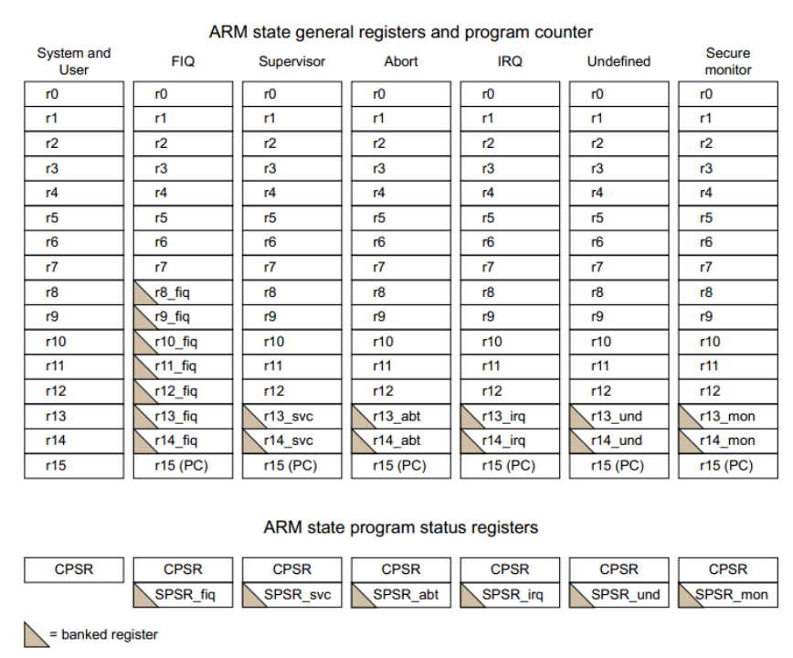
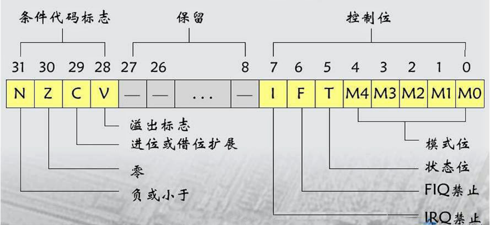

## 分类
- 通用寄存器
- 专用寄存器:比如pc,sp
- 控制寄存器:不同模式下的状态寄存器,CPSR寄存器
## 寄存器

- 分为通用与状态寄存器
- <font color=red>三角表示此状态下才可以该的寄存器</font>
- 总计40个寄存器
## 专用寄存器
- R15:Program Counter,Pc
- R14:LR,Link Register：每个模式下都有自己的lr(除了user和system共用)
- - <font color=red>作用1，相当到与risc-v 的ra寄存器
- - 作用2：发生中断，相当于risc-v 的sepc寄存器,保存被中断打断时候pc的数值</font>
- R12:Stack Pointer,sp

## CPSR寄存器

- Current Program Status Register.
- M4-M0分别控制模式
```
    [10000]User    
    [10001]FIQ     
    [10010]IRQ     
    [10011]SVC
    [10111]Abort   
    [11011]Undef   
    [11111]System  
    [10110]Monitor

```
- I,F分别对应IRQ,FIQ这两种中断，1表示禁止
- T: 指令的选择,0-arm,1-thumb
- N:相当于X86的SF,1表示符号位是负，0表示符号是正
- Z:相当于X86的ZF,1表示结果是0
- C:相当于X86的CF，只针对无符号运算
- V:相当于X86的OF，只针对有符号运算
```c
unsigned int a=0x0fffffff;
unsigned int b=0x01;

unsigned int c=a+b;
```
| 操作 | 结果 | C |
| - | - | - |
| 加法 | 进位 | 1 |
| 加法 | 不进位 | 0 |
| 减法 | 借位 | 0 |
| 减法 | 不借位 | 1 |

```c
int a=0x07ffffff;
int b=0x01;

int c=a+b;
```
| 操作 | 结果 | C |
| - | - | - |
| 加法 | 符号位进位 | 1 |
| 加法 | 符号位不进位 | 0 |
| 减法 | 符号位借位 | 0 |
| 减法 | 符号位不借位 | 1 |
