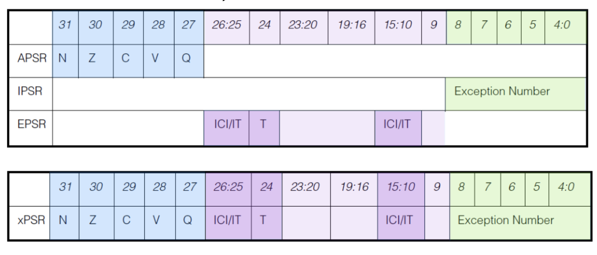

## 分类
- 通用寄存器
- 专用寄存器:比如pc,sp
- 控制寄存器:不同模式下的状态寄存器,CPSR寄存器
## 寄存器

- 分为通用与状态寄存器
- <font color=red>三角表示此状态下才可以该的寄存器</font>
- 总计40个寄存器
- SPSR_寄存器备份 发生中断模式下的 CPSR。
- lr_{mode} 保存中断恢复 的位置
## 专用寄存器
- R15:Program Counter,Pc
- R14:LR,Link Register：每个模式下都有自己的lr(除了user和system共用)
- - <font color=red>作用1，相当到与risc-v 的ra寄存器
- - 作用2：发生中断，相当于risc-v 的sepc寄存器,保存被中断打断时候pc的数值</font>
- R13:Stack Pointer,sp

## CPSR寄存器

- Current Program Status Register.
- M4-M0分别控制模式
```
    [10000]User    
    [10001]FIQ     
    [10010]IRQ     
    [10011]SVC
    [10111]Abort   
    [11011]Undef   
    [11111]System  
    [10110]Monitor

```
- I,F分别对应IRQ,FIQ这两种中断，1表示禁止
- T: 指令的选择,0-arm,1-thumb
- N:相当于X86的SF,1表示符号位是负，0表示符号是正
- Z:相当于X86的ZF,1表示结果是0
- C:相当于X86的CF，只针对无符号运算
- V:相当于X86的OF，只针对有符号运算
```c
unsigned int a=0x0fffffff;
unsigned int b=0x01;

unsigned int c=a+b;
```
| 操作 | 结果 | C |
| - | - | - |
| 加法 | 进位 | 1 |
| 加法 | 不进位 | 0 |
| 减法 | 借位 | 0 |
| 减法 | 不借位 | 1 |

```c
int a=0x7fffffff;
int b=0x01;
int c=a+b;


int a=-0x7fffffff;
int b=-0x02;
int c=a+b;

```
| 操作 | 结果 | V |
| - | - | - |
| * | >Tmax | 1 |
| * | <Tmin  | 1 |


## Contex-M xPSR(Program State Register)

- N,Z,C,V 同arm32
- Q:饱和标志。
- ICI/IT (Interrupt Continuable Instruction/IF-THEN):可中断-可继续的指令位，- - IF-THEN 指令的执行状态位。
- T:Thumb 状态标志位(总是1;如果试图将该位清零,会引起fault异常)。
- Exception Number:当前正在处理的异常号或中断号(2 表示 NMI，11 表示 SVCall，16 表示INTISR[0]，17 表示INTISR1],···,255 表 示INTISR[239]) 。


### 堆栈指针寄存器 R13

- 主堆栈指针(MSP)或写作 SP_main，是复位后默认的堆指针，由特权访问的用户使用。
- 进程堆栈指针(PSP)或写作 SP_process，由常规的用户应用程序使用。

### 中断屏蔽寄存器组

| 寄存器 | 描述 |
| - | - |
| PRIMASK | 1位,屏蔽 所有可屏蔽中断（IRQ），但 不影响 NMI 和 HardFault。|
| FAULTMASK | 屏蔽 所有异常（包括 HardFault），但不影响 NMI。|
| BASEPRI | 设置 最低可触发的中断优先级，高于该优先级的中断仍可触发。 |
| CONTROL | 控制寄存器，控制特权级和堆栈指针选择 |

###  控制寄存器 CONTROL
