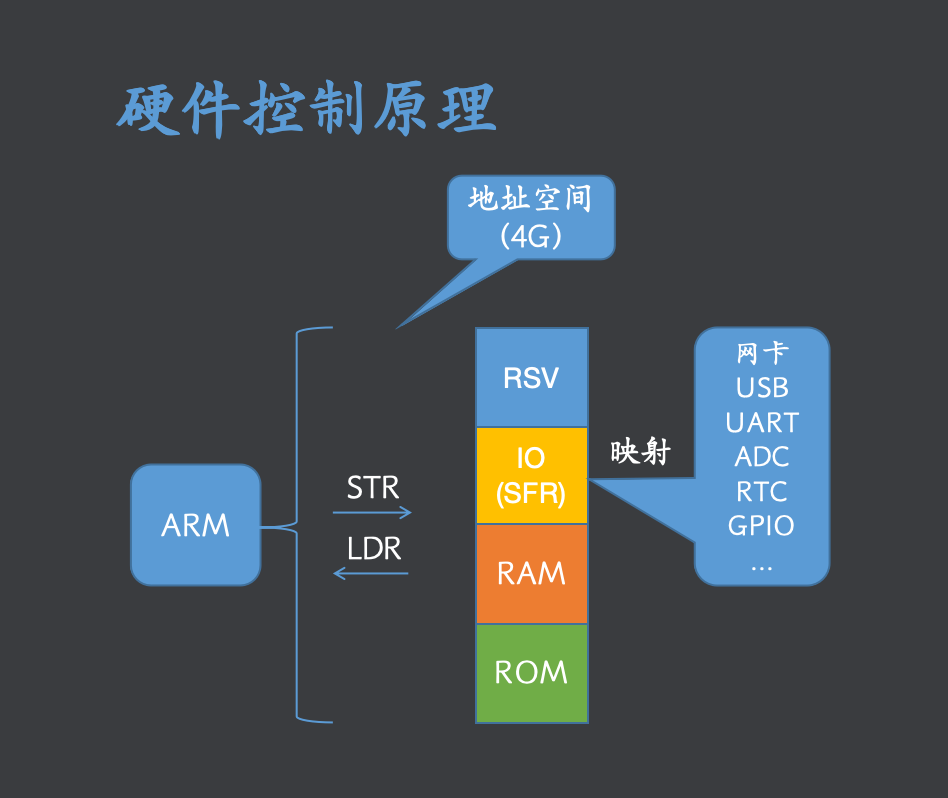
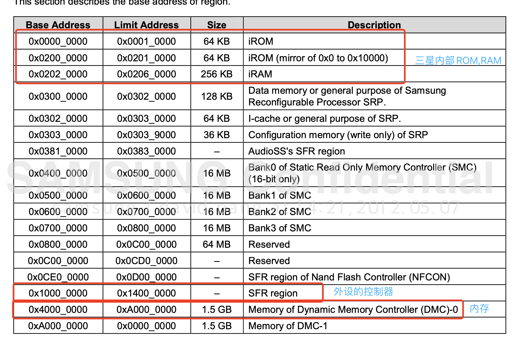
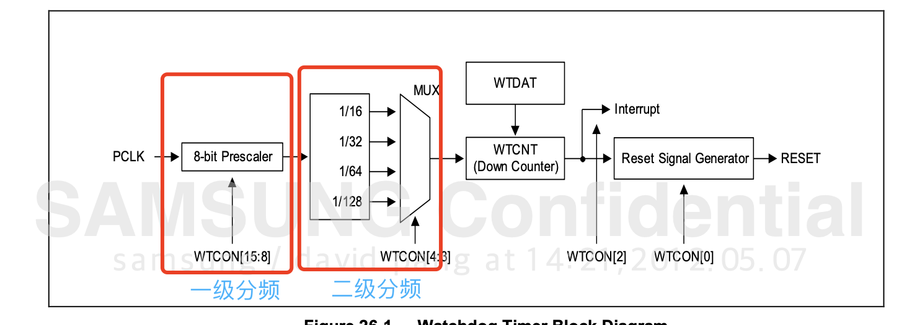
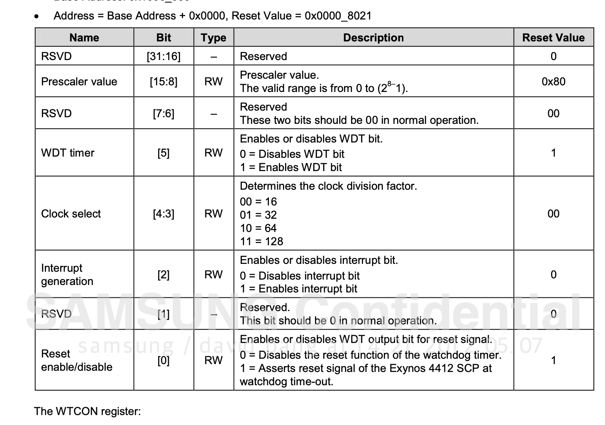
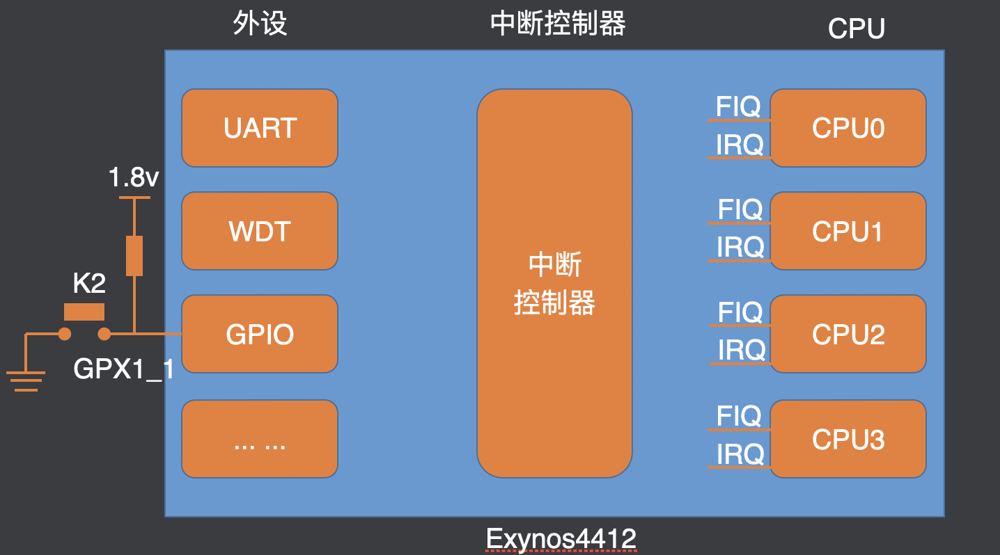

## 开发环境
- Samsung 2410A
- FS4412华清软件
- - cpu:exynos 4412,emmc:内存,net:dm9000
- - 网络标号：相同网络标号的电气是连在一起的
- - 元器件查找： 搜索丝印

## Arm开发版系列
- VExpress
- Versatile
## 地址映射表

- <font color=pink>设备控制器寄存器:设备控制器集成灶SOC上，通过寄存器来进行控制，寄存器会映射到机制空间</font>
- SFR:special functional register，特殊功能寄存器
- 查看芯片的地址映射手册



## GPIO Lab
- 6-1章节：GPX0, GPX1, GPX2, GPX3: 32 in/out ，分组，每组8个引脚
- 6-2章节：寄存器组:GPX2CON,GPX2DAT,GPX2PUD,GPXDRV
- 6-2.3.202:CPX2CON的配置，寄存器4个字节,每 4位控制一个引脚的模式
- 6-2.3.203:CPX2DAT的配置，寄存器只是用第一个字节，每位对应一个引脚

## UART Lab
- universal async recervicer transmiter
- [原理](labs/uart%E5%8E%9F%E7%90%86.md)
- 28.1章： ch0-ch3四个channel, FIFO,DATA shifter
- 28.6章: 寄存器
- GPA0_1,GPA0_2设置成uart

| 寄存器名字 | 配置项目 |
| - | - |
| ULCON2 | 传输位数,校验位，停止位 |
| UCON2 | read mode,write mode |
| UTRSTAT2 | RX、TX buffer status |
| UTXH2 | 发送缓冲区 |
| URXH2 | 接收缓冲区 |
| UBRDIV2 | 波特率 |
| UFRACVAL2 | 波特率 |

## WDT Lab
- 看门狗定时器，可以被用作普通的定时器，产生中断
- CPU定时重置定时器， 如果没有按时发生导致【定时器】超时，CPU会收到【定时器】的reset 中断？
- 一级分频可以分成 1-256份，二级只可以分成16,32,64,128份
- WTCON[2]控制是否输出中断信号， WTCON[0]控制是否输出REST信号




## 中断lab
```
本实验只设置了 引脚触发中断的方式， 当引脚有falling edge的时候，会产生一个
中断信号
```
- GPX1_1 设置成中断引脚
- 手册中 GPX{i} 后跟的 EXT_INT_{k} 是对引脚组{i}的对应 中断配置.
- EXT_INT_{k}_CON:配置中断的触发方式，H,L,rasing edge,failing?
- EXT_INT_{k}_FLTCON:配置中断是否使用【滤波器 光滑】,【滤波器种类】。
- EXT_INT_{k}_MASK:  中断的屏蔽寄存器，0-不屏蔽，1-屏蔽
- EXT_INT_{k}_PEND：  中断挂起位寄存器，1 表示有中断产生，但是CPU没有处理此中断（比如暂时禁止IRQ）,当中断处理完成，手动清0.
- <font color=red>注意，以上所有的配置 都是配置 GPIO的控制器</font>
## 中断控制器(GIC)
generic interrupt controller

中断控制器解决如下问题：

- 多个中断同时到来如何处理？  
- - 中断控制器排队中断，按序转发给CPU
- 中断分配给那个cpu?        
- - 决定 cpu的分配处理
- IRQ,FIQ?  
- - 可设置
- 不同类型中断如何区分？
- - 中断控制器内部寄存器 记录
- 中断优先级？
- - 中断控制器部寄存器 可设置每个中断优先级
- 中断控制器还可以 决定是否开启/屏蔽 某个中断。