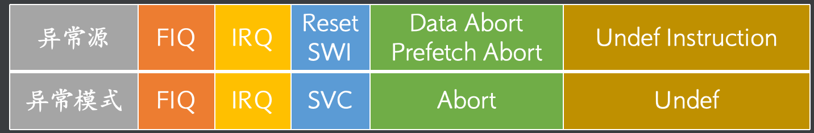
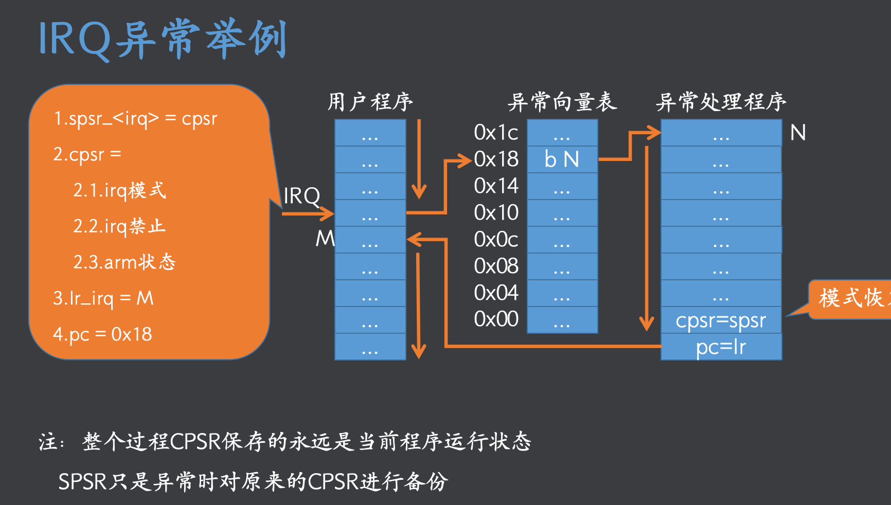
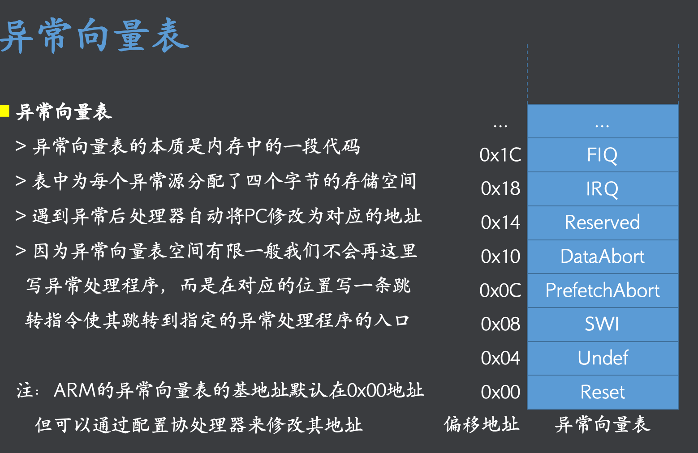

## 异常源
- 导致异常发生的事件是异常源
- 共有7类异常源

| 名称| |  
| -| -|  
| FIQ| 快速中断请求引脚有效，优先级高		 |  
| IRQ| 外部中断请求引脚有效，优先级低		 |  
| Reset| 复位电平有效		 |  
| Software Interrupt| 执行swi指令	 |  
| Data Abort	| 数据终止,数据不能R/W		 |  
|  Prefetch Abort	| 指令预取终止，取指令的mem不是可执行的	 |  
|  Undefined Instruction	| 遇到不能识别的指令	 |  

## 异常模式

- 遇到上面的中断源，会调到对应的 【模式】
- svc 对应Reset和 软中断
- Abort 对应数据和指令终止
- 启动一一对应

## 异常处理的流程


### 发生异常的时候
- 1.备份当前的状态,cpsr -> spsr_【mode】,mode对应上面的异常模式
- 2.修改cpsr的状态
- - 对该对应的【mode】模式
- - 禁用此类异常源,注意高优先级IR不会被低优先级IR打断。
- - 把T 设置从arm模式
- 3.保存中断处理后的返回结果到 lr_【mode】。pc->lr_【mode】
- <font color=red>4.跳转到异常中断向量表的该中断入口
- - 异常中断向量表是内存的空间，4*8的字节，早期异常中断向量位置在0X00,现在可以修改
- - 每个类型的异常的代码占4个字节，一般存放一个跳转指令，跳到用户定义的处理函数
- 5.执行向量表的跳转语句，调到自定义的处理handler.</font>
### 从异常返回的时候
- - 1.恢复cosr,spsr_【mode】->cpsr
- - 2.跳转回中断点，lr_【mode】->pc

### 异常优先级
- 中断：RST > DATA ABORT > FIQ > IRQ >FETCH > SOFT INTERRUPT > Undefine instruction
- 高优先级可以打断低优先级的处理，反之不能
- 同时的异常，先处理  高优先级中断
-  <font color=red>FIQ的 异常向量表的入口在最末端，可以省去跳转
- FIQ有 本模式下独有的 r8-r12，可以省去对通用r8-r12的现场保护。</font>


### 软中断的异常处理程序
```
.text
.global _start @可被其他模块引用
_start: @入口

@异常向量表
B MAIN
B .
B SWI_HANDLER    @软中断入口
B .
B .
B .
B .
B .

@主程序
MAIN:
MOV SP,#0x40000020 @设置SVC模式下的STACK

MSR CPSR,#0x10    @切换用户模式 
MOV R1,#1
MOV R2,#2

SWI #1
ADD R3,R2,R1

STOP:
B STOP

@软中断处理,模式是SVC
SWI_HANDLER:
STMFD SP!,{R1,LR}
MOV R1,#1000
LDMFD SP!,{R1,PC}^  @ ^表示把SPSR_SVC 恢复给 CSPR

.end

``` 