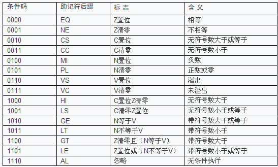
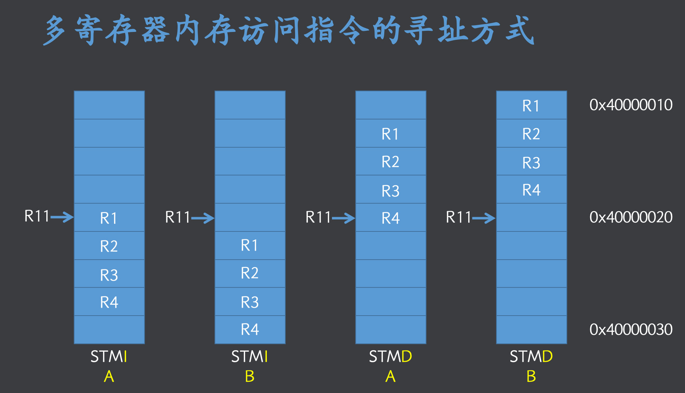

## 指令集
-   ARM指令集:  PC+=4,指令长度32位
- Thumb指令集： PC+=2,指令长度16位

```asm
.text
.global _start @可被其他模块引用
_start: @入口

    MOV R1,#1
    MOV R2,#1 
stop: 
    b stop
.end @结束

```

## 指令二进制格式
```sh
# 其中，<>内的项是必需的，{ }分内的项是可选的。
<opcode>{<cond>}{s}  <Rd> , <Rn> {,<operand2>}
```
- opcode: 指令助记符(必需)，如 MOV、LDR 等
- cond: 表示指令的执行条件，如果没有，表示无条件执行
- S:决定是否影响 APSR 寄存器中相应的标志位(可选，如果没有表示不影响)
- Rd:目标寄存器(必需)，该指令执行结果的存储处。
- Rn:第一操作数的寄存器(必需)。
- 第二操作数(可选)。可以是立即数、寄存器或者寄存器移位 等方式

## 常见的条件

| 条件码 | 描述 | 标志 |
|--------|------|------|
| EQ     | 等于 (Equal) | Z=1 |
| NE     | 不等于 (Not Equal) | Z=0 |
| HS     | 高于或同级 (Higher or Same, unsigned >=) | C=1 |
| LO     | 低于 (Lower, unsigned <) | C=0 |
| MI     | 负数 (Minus, negative) | N=1 |
| PL     | 正数或零 (Plus, positive or zero) | N=0 |
| VS     | 溢出 (Overflow) | V=1 |
| VC     | 无溢出 (No Overflow) | V=0 |
| HI     | 高于 (Higher, unsigned >) | C=1 and Z=0 |
| LS     | 低于或同级 (Lower or Same, unsigned <=) | C=0 or Z=1 |
| GE     | 大于或等于 (Greater or Equal, signed >=) | N=V |
| LT     | 小于 (Less Than, signed <) | N!=V |
| GT     | 大于 (Greater Than, signed >) | Z=0 and N=V |
| LE     | 小于或等于 (Less or Equal, signed <=) | Z=1 or N!=V |
| AL     | 总是 (Always, unconditional) | - |
| NV     | 从不 (Never, should not be used) | - |

## 汇编
- 指令
- 伪指令
- 伪操作：告诉编译器如何生成代码，类似于C预处理,GNU伪操作如下
```sh
.global symbol  #symbol可以被其他文件引用

.local  symbol

.equ DTAT, 0xff #宏定义，DATA=0xfff

.macro FuncName  #模块化
 指令1
 指令2
.endm


.if 1   #条件编译
 指令1
 指令2
.endif

.rept 3 #重复代码
 指令1
 指令2
.endr

.word 0xffeeccdd #在当前地址位置，防止一个word,0xffeeccdd
.byte 0x22
.space 12,0x12  #当前位置申请任意字节,初始化0x12

.align k #后面第指令，2^k对齐


.arm
.thumb

.text   #.text表示代码段
.end    #.end表示汇编的结束
```
## Arm指令
- 数据处理指令
```
#操作码   目标寄存器  第一操作寄存器  第二操作数

mov r1 #33
mvn r1 #0xff  @ r1=~0xff=0xffffff00


ADD R3,R1,R2
ADD R3,R3,#2 @支持立即数


SUB R3,R1,#2 @R3=R1-2
RSB R3,R1,#2 @R3=2-R1

MOV R1,#1
MOV R2,#4 
MUL R3,R1,R2 @不支持立即数


AND R3,R1,R2 @与
ORR R3,R1,R2 @或
EOR R3,R1,R2 @异或


MOV R1,#1
LSL R3,R1,#2  @左移
MOV R1,#4
LSR R3,R1,#2  @ R3=R1>>2


MOV R1,#0xffffffff
BIC R3,R1,#0x01 @清0， R3=R1.clear(0b00000000000000000000000000000001)


MOV R2,#1
MOV R3,R2,LSL #1 @格式扩展，R3=R2,LSL #1，  R2,LSL #1等价于  LSL R2 #1
```

- N,Z,C,V四个状态位置需要在指令后面加上S才可以被修改
```

MOV R1,#1
MOV R2,#2 
SUBS R1,R2  @ N=1,表示产生负数


MOV R1,#1
MOV R2,#1 
SUBS R1,R2  @ Z=1,C=1,表示0，减法没有借位


MOV R1,#1
MOV R2,#0xFFFFFFFF 
ADDS R1,R2  @C=1,Z=1，因为结果是0，加法产生进位


MOV R1,#0X80000000
MOV R2,#0x01 
SUBS R1,R2    #Z=0，V=1，表示符号位异出

```

- 利用进位C，可以计算大于32位的+、-
```
@ 计算 0x00000001 ffffffff + 0x00000001 0x00000002
@ = 0x00000003 0x00000001
MOV R1,#0x00000001
MOV R2,#0xffffffff
MOV R3,#0x00000001
MOV R4,#0x00000002

ADDS R6,R2,R4 
ADC R5,R1,R3  @带进位的加法 R5=R1+R3+C


@ 计算 0x00000002 0x00000001 - 0x00000001 0x00000002
@ = 0x00000000 0xffffffff
MOV R1,#0x00000002
MOV R2,#0x00000001
MOV R3,#0x00000001
MOV R4,#0x00000002
SUBS  R6,R2,R4
SBC   R5,R1,R3   @ R5=R1-R3-!C
```
- 跳转指令

```

MAIN:

MOV R1,#1
MOV R2,#2
BL  FUNC  @bl指令会把下一指令地址保存到LR中
MOV R3,#3
MOV R4,#4


FUNC:
MOV R3,#3
MOV R4,#4

BX LR  @返回
```

```sh
@条件吗演示
mov r1,#1
mov r2,#2
cmp r1,r2 @ r1-r2
blt func_lt
mov r7,#7

func_lt:

mov r5,#5
mov r6,#6

movlt r5,#55 @条件吗可以接任何指令
```


- Load/Store
```

MOV R1,#0XFF000000
MOV R2,#0X40000000
STR R1,[R2] @写数据

LDR R3,[R2] @读取数据


STRB R1,[R2]  @存储byte
STRH R1,[R2]  @存储half word


LDRB R1,[R2]  @读取byte
LDRH R1,[R2]  @读取half word


STR R1,[R2]      @基址寻址
STR R1,[R2,#4]   @变址寻址,前索引, R1->[R2+4]
STR R1,[R2],#4   @变址寻址,后索引, R1->[R2],R2+4->R2
STR R1,[R2,#4]!  @变址寻址,后索引, R1->[R2+4],R2+4->R2


MOV  R11,#0X40000000    @保存基址
STM  R11,{R1,R2,R3,R4}  @批量寄存器存储,寄存器列表顺序无关
STM! R11,{R1,R2,R3,R4}  @批量寄存器存储,R11自增 4*4=16
LDM  R11,{R1,R2,R3,R4}  @批量寄存器读取

```


```sh
增栈(A)：压栈对应sp增加
减栈(D)：压栈对应sp减少
满栈(F)：sp指向最后压入的元素. eg:插入的时候发现栈满了，所以先修改sp才压栈。
空栈(E)：sp指向最后压入的元素相邻位置

满减栈（FD）是arm常用的方式：


对应 STM的伪指令
STMFD--->STMDB 
LDMFD--->LDMIA

#`STMDB`（Store Multiple Decrement Before）指令用于将多个寄存器的值存储到内存中，并在存储之前递减基址寄存器的值。

LDMFD--->LDMIA
#  LDMFD（Load Multiple Inrement After)
```
- CPSR传输指令
```SH
@0xd3 = 1101 0011 
@110 -> FIQ=1,IRQ=1,Arm 10011->svc
MRS R1,CPSR @读取到R1


@ 0 0 0 1 0 0 0 0 
@ FIQ=0,IRQ=0,ARM,10011->user
MSR CPSR,#0x10  @写入 CPSR
```
- [软中断指令](%E5%BC%82%E5%B8%B8%E6%9C%BA%E5%88%B6.md)
- 协处理器指令
- 伪指令
```
NOP  @ 空指令，等价MOV R0,R0

LDR R1,=0X12345678 @  R1=0X12345678
LDR R1,=STOP   @    R1=STOP地址
LDR R1,STOP    @    R1=STOP内容
```
- 伪操作
- C与汇编调用注意事项
- - C 调ASM， Asm需要伪指令.global
- - ASM调用C， 需要初始化sp寄存器