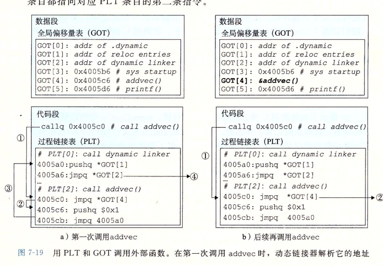
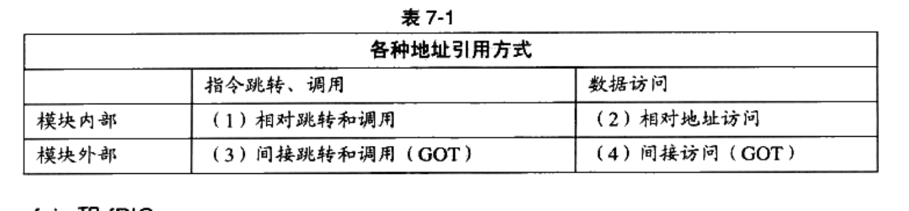

# 本章节的实际应用
有[addvec.c](lib%2Faddvec.c)，[multvec.c](lib%2Fmultvec.c) 两个我开发的库文件
## 静态库
- 生成库文件
```shell
#先生成.o文件
clang -g  -c  addvec.c multvec.c
#再打包成.a文件
ar rcs libvector.a addvec.o multvec.o

#查看 打包的.o
ar -t libvector.a
#解压 .o到当前目录
ar -x libvector.a
```
- 检查库文件
```shell
# 可以看到 addvec.o 中 addcnt，addvec，multvec.o中 multcnt，multvec，共四个符号
nm libvector.a 
```

- 使用库文件
```shell
clang libvector.a link_call_static.c -o link_call_static
# 可以看到 addcnt，addvec，multcnt，multvec四个符号,说明引用的是静态库
nm link_call_static
```
## 编译动态库
- 编译库文件
```shell
#注意mac下会 libvector.dylib.dSYM文件夹，这是符号表，用于gdb
clang -shared -fpic  -o libvector.dylib  addvec.c multvec.c

# 可以看到 addcnt，addvec，multcnt，multvec四个符号
nm libvector.dylib
```
- 编译时使用库文件
```shell
clang libvector.dylib link_call_shared.c -o link_call_shared

# 只有_addvec,_multvec两个符号，说明没有把函数的实现打包到link_call_shared中
nm link_call_shared
```
- <font color=red>运行时使用动态库</font>
```shell
#先检查下需要的动态库
ldd link_call_shared        #linux
otool -L link_call_shared   #mac

#需要的库路径设置给如下的环境变量,环境变量表示运行时 动态库文件检索目录
LD_LIBRARY_PATH         #linux
DYLD_LIBRARY_PATH       #mac

#执行程序
./link_call_shared
```
- <font color=red>编译可执行文件</font>
```sh
x86_64-elf-gcc -I $Include -L $Lib -static  -nostartfiles $Lib/crt1.o  $Lib/crti.o  $Lib/crtn.o a.c
```
## 同时存在 静态动态库，链接器会先选择谁
假设同时存在 libvector.a,libvector.dylib在build目录，使用如下命令
```shell
clang -L build  -lvector main.c  -o main
```
生成的main使用的是libvector.dylib.
## 单步调试库文件
- 保证运行时，可以找到对应的动态库
- - 设置LD_LIBRARY_PATH环境变量
- - 或拷贝动态库到 [cmake-build-debug](..%2Fcmake-build-debug)
- 库源代码必须在工程内部
- 对呀mac,符号表目录dylib.dSYM不要删除


注意以下问题：
- <font color=pink>符号表，源代码，生成的dylib文件版本要一致,不然clion能步入</font>。
- clion会对项目中的文件建立索引，所以【源代码，符号表】放在任何目录下都不影响clion能步入
## 级联调用
库[linear.c](lib%2Flinear.c)的函数调用libvector的函数，把linear.c也做成共享库，由
[link_call_linear.c](link_call_linear.c)来调用。

```
link_call_linear->liblinear(shared lib)->libvector(shared lib)
```
按照上面的步骤，可以看出 调试 是完全没有问题的。

## 地址重定向
### 问题的提出
```c
int f(){
    g();
}
```
- 在gcc -c f.c生成f.o的时候，f 调用了 g
- 不论g是本模块定义还是外部引用， 在连接的时候，g的地址才会被确认下来，编译的时候不会知道g的地址
- 所以针对上面问题，需要生成一条 RELA(地址重定向条目)，保存在.rela.text节中
- 在链接的过程中，根据RELA，确定引用符号g 时候call 的地址.
```c
//针对一个节 中符号的重定向结构
struct {
    int symbol;  //要定位的符号, 比如上面的g
    int offset; //需要修改 字节的 相对偏移(相对f的节地址),
    int add;    // offset -下一条指令地址的相对offset
    int type    //pc相对寻址，绝对寻址
}RELA;

RELA r;
```

### pc32寻址的地址计算

- pc32表示： callq $x, 跳转到 rip+$x 的位置
- <font color=pink>$x= Addr(sym)-Addr(s)-r.offset+r.add, 注意：s.addr+r.offset-r.add,就是运行时候的rip</font>
- <font color=pink>Addr(sym),Addr(s) 分别表示 链接的时候ld 确定的 符号和节的 绝对地址</font>.

### 绝对寻址的地址计算
- <font color=pink>$x= Addr(sym)+r.add</font>

## PIC
- position independ code：与位置无关的代码
- PIC函数对全局全局数据的 引用 过程：
- - <font color=red>全局变量 进程是不共享的</font>
- - <font color=red>对全局变量的引用需要 动态连接器 重定向</font>
- - GOT: 数据段的开头保存这张表，表每个入口(8byte)都是对全局数据的引用
- - 代码段与数据段的偏移是常数，
- - 生成的对全局变量的引用，利用了上面的特性，引用的是GOT表中定义的地址。


```shell
gcc -shared -fpic -o libveetor.so addvee.c multvec.c
```
libvector.so
```C
int addcnt = 0;
void addvec(int *x, int *y,int *z, int n) 
{
    addcnt++;

}
```
```asm
   # gcc -c addvec.c,生成如下代码， 
  13:   8b 05 00 00 00 00       mov    0x0(%rip),%eax        # 19 <addvec+0x19>
              15: R_X86_64_PC32       addcnt-0x4
  19:   83 c0 01                add    $0x1,%eax
  1c:   89 05 00 00 00 00       mov    %eax,0x0(%rip)
  
  # gcc -c -fpic addvec.c ,生成如下代码
  
  13:   48 8b 05 00 00 00 00    mov    0x0(%rip),%rax        # 1a <addvec+0x1a>
                 16: R_X86_64_GOTPCREL   addcnt-0x4
  1a:   8b 00                   mov    (%rax),%eax
  1c:   8d 50 01                lea    0x1(%rax),%edx
  1f:   48 8b 05 00 00 00 00    mov    0x0(%rip),%rax        # 26 <addvec+0x26>
                 22: R_X86_64_GOTPCREL   addcnt-0x4
  26:   89 10                   mov    %edx,(%rax)
```

- 其他模块调用PIC 函数
- - GOT:每个条目(8Byte) 记录 pic函数的地址
- - GOT[0]，GOT[1],GOT[2]是特殊条目， GOT[O]和 GOT[l]包含ld在解析函数地址时 会使用的信息。 GOT[2]是动态链接器在 ld-linux.so 模块中的入口点。
- - PLT:Procedure Linkage Table, 每个条目16字节，每个条目对应 一个跳转到 响应pic 的代码
- - PLT[0] 对应调转到ld.so的代码，PLT[1]代表跳转到__lib_start_main的代码。


- 1.调用pic函数， 会跳转到 pic函数对应的PLT条目。
- 2.跳转到对应的GOT[i]
- 3.GOT[i]初始保存 下一条指令的地址，第二次调用保存对应 PIC函数的地址.
- 4.第一次执行的时候， 会跳到PLT[0]， PLT[0]是ld,解析完成 PIC函数的地址后，更新GOT[i]
```shell
数据段
GOT[0]
GOT[1]
GOT[2]=&addcnt  #&addcnt的地址,动态连接器会 重定向这个数值！

代码段
mov 1234(%rip) %ax #GOT[2]相对于当前位置rip的偏移是 1234
                  # 把这个地址的数值&addcnt，赋值给ax
add 1 (%ax)         # 等价于 
```

## 符号表/调试信息
- 符号表是记录程序中 函数的名字，全局变量，局部变量等等。
- 在符号表的基础上，可以加入关于调试的信息，才可以使用gdb来进行调试。
- <font color=red>nm,strip工具是用于查看符号表和删除符号表的工具</font>
```shell
#T表示text,D-全局变量，S-未初始化全局变量，U-没有定义的符号(.o文件出现)
nm libc.a |grep memset|grep T

#仅剥离调试信息，保留符号表
strip -g a.out
#剥离所有符号表和调试信息
strip -s a.out
```
## libc
- glibc是gnu library C,其中包括许多系统调用和对posix的支持
- uClibc是嵌入设备用的C库，体积很小
```sh
# 以下方法可以查看libc的版本
# 1
ldd --version
# 2
/lib64/libc.so.6
```
## 调试ffmpeg源码
- 编译的时候加入了--extra-cflags=-g,【非必须】
- 手动创建了符号表 [symbol.sh](symbol.sh)

## mac下生成符号表

```shell
dsymutil aa.dylib
```


## 动态库相关的节 

- .dynamic： 关于动态库中的信息， 比如 (.dynsym,.dynsym,.dynstr,.rela.dyn,.rela.plt)的地址。
- .dynsym: 动态库支持导出的 符号
- .dynstr: 动态库中的字符串
- .rela.dyn： .got中需要重定向的地址
- .rela.plt   .plt.got中需要重定向的地址。

### 对比编译重定向与加载重定向
```sh
# 编译
.text  <--- .rela.text, 使用.sym

# 加载
.got      <------ .rela.dyn, 使用.dynsym
.plt.got  <------ .rela.plt, 使用.dynsym
```