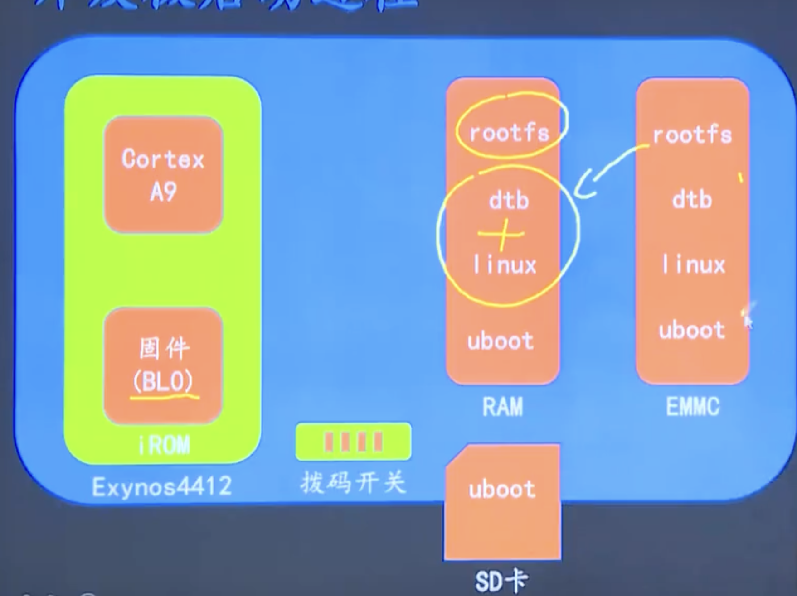

](imgs/start.png)

- 1.固件BL0(0地址) 读取拨码开关状态，选择从SD还是EMMC(相当于磁盘)启动。
- 2.执行SD或者EMMC的(先加载到硬盘) uboot.
- 3.uboot 加载linux kernel,dtb(设备树),rootfs(根文件系统),然后允许kernel
- 4.kernel 最后挂载文件系统
- rootfs:记录文件系统的meta data,例如super blocks. inodes blocks,data blocks,logging blocks
- dtbs(设备树): 和平台设备有关，kernel是通用代码，而dtbs是平台之前的定制化代码。
- - device tree source
- - 驱动设计：驱动逻辑(uImage) 与 硬件描述分离(dtbs).
- - 设备树是设备的硬件描述信息（比如串口引脚），可以类比成配置文件。