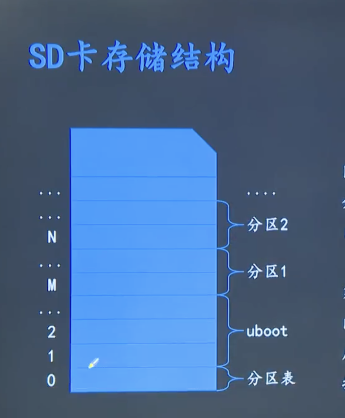

-## [Qemu模拟](https://www.zhaixue.cc/qemu/qemu-u-boot.html)
## bootloader
- Bootloader是硬件启动的引导程序；
- kernel之前运行的一小段代码。对软硬件进行相应的初始化和设定,最终加载kernel

## 常用的bootloader


## 制作uboot启动盘


- SD卡单位是block,block size=512
- block 0是分区表，记录对磁盘的分区信息
- block 1是uboot区，bios会加载这里的代码开始运行。

```sh
## 制作uboot img

# 方法1：

# 输出1个block,内容是0
dd if=/dev/zeros of=zeros.bin count=1
# bootloader.bin就是sd卡的镜像
cat zeros.bin u-boot-fs4412.bin > bootloader.bin

# 方法2
# 上面2个命令 等价于以下命令，seek表示偏移是1个block
# dsync强制 数据写入到底层设备（如磁盘）中
dd iflag=dsync oflag=dsync if=u-boot-fs4412.bin  of=bootloader.bin seek=1 

#这个sdb是sd卡设备，以下命令我没有执行
dd iflag=dsync oflag=dsync if=bootloader.bin of=/dev/sdb
```
## uboot
- 自启动模式： 从固定设备的位置，加载kernel到ram中。
- 交互模式： 用户干预后，执行用户输入命令

```sh 
help        #显示全部命令
help <命令>
printenv    #打印all 环境变量
setenv ipaddr 192.168.1.22 #ram中设置 环境变量 
saveenv #把环境变量全部保存到emmc(持久化)中

# 从server下载文件到 内存地址
tftpboot [memaddr] server file #eg tftp 0x60003000 dtb 

go <地址> #运行地址处的代码

# memaddr 与 dev 中的 block之间的传输命令
mmc read [memaddr] dev blockno cnt
mmc write [memaddr] dev blockno cnt
mmc list

# 常用环境变量：
# serverip：tftp的服务器地址
# ipaddr: 开发版的ip地址
# bootcmd: 自启动模式下运行的命令，\;分隔语句
# eg1:
# setenv bootcmd tftpboot 0x40008000 192.168.1.2 kernel.bin\;go 0x40008000
# eg2:
# setenv bootcmd mmc read 0x40008000 0 <blockno> 1\;go 0x40008000
```

## 安装uboot到emmc([uboot](data/uboot/u-boot-fs4412.bin))
```sh
tftpboot 0x41000000 u-boot-fs4412.bin
# 拷贝到dev=0的设备上的0x0位置,0x800块(blocksize=512)
mmc write  0x41000000 0x0 0x800
```

## uboot移植
### 代码结构
- arch：构架平台相关代码:arch/arm/cpu
- board:开发版平台相关代码
- configs：不同开发版编译配置信息
### 配置命令
- make [boardname]_defconfig,见configs目录
- 设置Makefile的 CROSS_COMPILE, CROSS_COMPILE是编译器的前缀。

## 编译生成文件
- uboot:elf格式，运行在qumu上
- uboot.bin:裸机格式(objcopy),运行在开发版上(类似于 objdump -O binary -S uboot uboot.bin)
- uboot:lds:链接脚本
```sh
# 删除中间文件.o
make clean
# 删除中间文件.o +生成的uboot
make distclean
```

