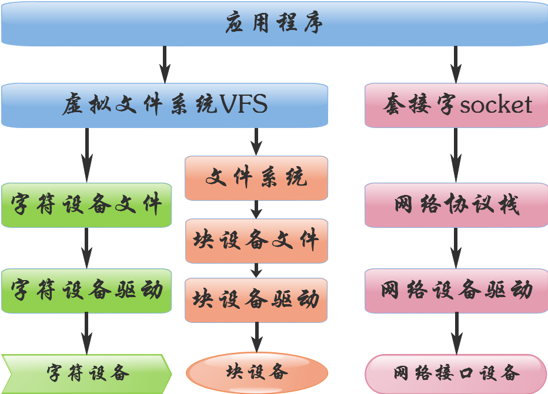
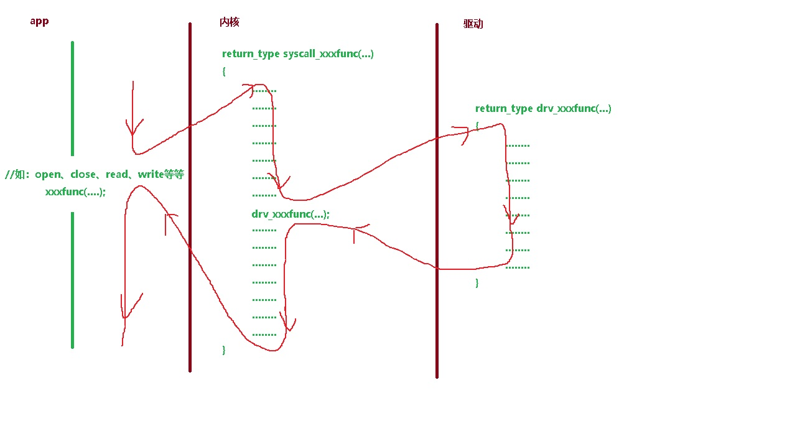
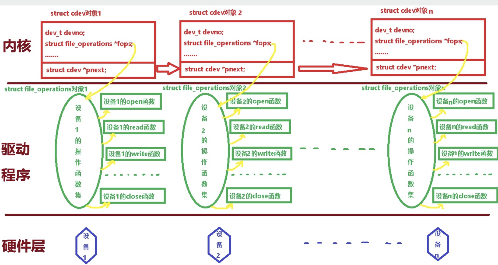
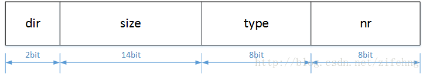

# 设备

- VFS:虚拟FS,提供系统调用open,read,write,lseek
- 文件类型：
- - 目录(d)，管道(p)，链接(l),unix Socket(s),字符设备(c),块设备（b）
- - 设备分为三类:字符设备,块设备,网络设备
- 32位的设备号：主设备号（12），从设备号(20)
- <font color=red>访问设备必须通过设备文件：  设备文件与普通文件都一样，需要的的major和minor,用户找到底层的设备</font>
- <font color=pink>块设备 的文件系统具体某个格式的文件系统，比如ext3,nfs...</font>
- 创建设备文件：
```shell
 #mknod -m <perm> name <type> <major>  <minor>
 mknod -m 666 console c 5 1
```

```c
//xv6的设备号定义的宏

#define major(dev)  ((dev) >> 16 & 0xFFFF)
#define minor(dev)  ((dev) & 0xFFFF)
#define	mkdev(m,n)  ((uint)((m)<<16| (n)))
```

```c
//linux设备号编程
dev_t devno = MKDEV(249,1);
int major = MAJOR(devno);
int minor = MINOR(devno);


// pathname:带路径的设备文件名，无路径默认为当前目录，一般都创建在/dev下
// mode：文件权限 位或 S_IFCHR/S_IFBLK
// dev:32位设备号
// 返回值：成功为0，失败-1
int mknod(const char *pathname,mode_t mode,dev_t dev);


// linux 内核设备号与 使用fstat 获得设备号的转换 
fstat(fd,&stat)
stat->st_rdev = (major << 8) | (minor & 0xff) | ((minor & 0xfff00) << 12)
```

## 注册设备号
- 见[register_dev.c](data/register_dev.c)
- 注册的设备号可以从/proc/devices查看
- 字符设备与块设备是两套设备号
- 注册设备号与创建设备文件的区别？
- - 设备文件创建的时候，使用的设备号必须是【经过注册设备号】的，否则无法关联【注册字符设备】

## 注册（定义）字符设备
- 注册字符设备相当于创建 一直设备的类模板，定义了操作设备的方法。
- 实际就是提供给内核 对某种字符设备如何操作
- file_operations是真正的操作实现，见[fs.h](data/fs.h).
- 练习[my_cdev.c](data/my_cdev.c),[open_dev.c](data/open_dev.c)
```c
// ./linux/cdev.h
struct cdev {
        struct kobject kobj;  //cdev 继承自kobj
        struct module *owner; //设备的拥有者，填THIS_MODULE
        const struct file_operations *ops; //真正的 操作实现
        struct list_head list;//本设备的设备列表,链表指针域
        dev_t dev;//主设备号？
        unsigned int count;//所有的设备数量
} __randomize_layout;
```

- 上图展示了syscall与设备驱动之间的关系，最终调用的是file_operations 结构体的某个方法
- 内核会有一段通用代码，比如访问权限校验，根据文件名获得file对象，。。。，然后根据file.type,major选择对应的cdev,调用cdev.file_operations.method
- [如何避免引用全局变量](data/my_cdev_read_write_obj.c)


## R/W Ioctl
- 设备读写： [my_cdev_read_write](data/my_cdev_read_write.c),[open_dev_read_write](data/open_read_dev.c)

```c
     #include <sys/ioctl.h>
     int ioctl(int fd, unsigned long cmd, unsigned long arg);
```



- dir:R,W,None，或者RW
- size:ioctl的args参数的空间
- type:'a','b','c','d'焕数
- nr:变化，从 0 开始编号递增；
- [my_cdev_read_write_ioctl](data/my_cdev_read_write_ioctl.c),[open_read_ioctl_dev](data/open_read_ioctl_dev.c)
```c
#define _IOC(dir,type,nr,size) (((dir)<<_IOC_DIRSHIFT)| \
                               ((type)<<_IOC_TYPESHIFT)| \
                               ((nr)<<_IOC_NRSHIFT)| \
                               ((size)<<_IOC_SIZESHIFT))
/* used to create numbers */

// 定义不带参数的 ioctl 命令
#define _IO(type,nr)   _IOC(_IOC_NONE,(type),(nr),0)

//定义带读参数的ioctl命令（copy_to_user） size为 参数的大小
#define _IOR(type,nr,size)  _IOC(_IOC_READ,(type),(nr),(_IOC_TYPECHECK(size)))

//定义带写参数的 ioctl 命令（copy_from_user） size为类 参数的大小
#define _IOW(type,nr,size)  _IOC(_IOC_WRITE,(type),(nr),(_IOC_TYPECHECK(size)))

//定义带读写参数的 ioctl 命令 size为 参数的大小
#define _IOWR(type,nr,size) _IOC(_IOC_READ|_IOC_WRITE,(type),(nr),(_IOC_TYPECHECK(size)))

/* used to decode ioctl numbers */
#define _IOC_DIR(nr)        (((nr) >> _IOC_DIRSHIFT) & _IOC_DIRMASK)
#define _IOC_TYPE(nr)       (((nr) >> _IOC_TYPESHIFT) & _IOC_TYPEMASK)
#define _IOC_NR(nr)     (((nr) >> _IOC_NRSHIFT) & _IOC_NRMASK)
#define _IOC_SIZE(nr)      (((nr) >> _IOC_SIZESHIFT) & _IOC_SIZEMASK)
```