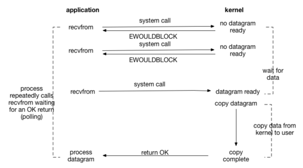

## 5种IO模型
- 阻塞
- 非阻塞

- 多路复用
- 信号:收到信号后读
- 异步IO(DMA):收到信号后读完成


## 阻塞

- 就系队列：runnable 的进程，可以被scheduler调度。
- 等待队列：资源不满足的情况下把进程插入到此队列，此队列的进程不会被scheduler调度，进程是sleep态。
- 等待队列分为2中，可被信号中断的 和不可 被信号中断的
- 一旦满足再次被调用条件，需要wakeup 等待队列
- [block_demo.c](data/io_block_demo.c)
```c
// 应用层设置 阻塞与非阻塞
void set_fd_noblock(int fd) {
    int flag = fcntl(fd, F_GETFD);
    fcntl(fd, F_SETFD, flag | O_NONBLOCK);
}
void set_fd_block(int fd) {
    int flag = fcntl(fd, F_GETFD);
    fcntl(fd, F_SETFD, flag & (~O_NONBLOCK) );
}
```

```c
// 驱动层等待队列 
wait_queue_head_t wq//等待队列头数据类型
init_waitqueue_head(wait_queue_head_t *pwq) //初始化等待队列头
    
// 睡眠
wait_event_interruptible(wq,condition)
/*
功能：条件不成立则让任务进入浅度睡眠，直到条件成立醒来
    wq:等待队列头
    condition：C语言表达式
返回：正常唤醒返回0，信号唤醒返回非0（此时读写操作函数应返回-ERESTARTSYS）
*/
        
wait_event(wq,condition) //深度睡眠


// 唤醒
wake_up_interruptible(wait_queue_head_t *pwq)  
wake_up(wait_queue_head_t *pwq)

```

- linux 底层的实现，wait 的实现
```c
    //wait_event_interruptible(wq,condition)宏的展开
	DEFINE_WAIT(__wait);								
	while(1) {							
		prepare_to_wait(&wq, &__wait, TASK_INTERRUPTIBLE);
		if (condition)						
			break;			
        // <--- 如果这里发生 wakeup_event(&wq)会有 导致长期睡眠吗？
        //不会：  因为 prepare_to_wait已经把 当前进程 加入了 wq, wakeup_event
        // 如果在这里发生，会把 进程状态从 TASK_UNINTERRUPTIBLE 改成 runnable
        // 后面的 schedule立刻 返回，			
		if (!signal_pending(current)) {//没信号的时候执行 切换上下文		
			schedule();					
			continue;					
		}							
		ret = -ERESTARTSYS;					
		break;							
	}								
	finish_wait(&wq, &__wait);					

     //wait_event(wq,condition)宏的展开
    DEFINE_WAIT(__wait);
	while(1) {	
		prepare_to_wait(&wq, &__wait, TASK_UNINTERRUPTIBLE);
		if (condition)						
			break;		
        // <--- 如果这里发生 wakeup_event(&wq)会有 导致长期睡眠吗？
        //不会：  因为 prepare_to_wait已经把 当前进程 加入了 wq, wakeup_event
        // 如果在这里发生，会把 进程状态从 TASK_UNINTERRUPTIBLE 改成 runnable
        // 后面的 schedule立刻 返回，
		schedule();						
	}
	finish_wait(&wq, &__wait);	
```
- wakeup 的实现
```c

#define wake_up(x)			__wake_up(x, TASK_NORMAL, 1, NULL)
#define wake_up_all(x)			__wake_up(x, TASK_NORMAL, 0, NULL)
#define wake_up_interruptible(x)	__wake_up(x, TASK_INTERRUPTIBLE, 1, NULL)

// mode: TASK_NORMAL,或者 TASK_INTERRUPT
// nr_exclusive: 只对 exclusive 标志的进程有用，表示唤起的数量，否则是全部唤起
// sync： 1
// key：NULL

//kernel/sched.c
static void __wake_up_common(wait_queue_head_t *q, unsigned int mode,
			     int nr_exclusive, int sync, void *key)
{
	wait_queue_t *curr, *next;

    //遍历队列，执行 队里项的 func
    // func 最终调用 try_to_wake_up(struct task_struct *p, unsigned int state, int sync)，改变进程的状态位 runnable, 把进程放入到 cpu.rq（运行队列中）
	list_for_each_entry_safe(curr, next, &q->task_list, task_list) {
		unsigned flags = curr->flags;

		//try_to_wake_up(curr->private, mode, sync);
		// 简单说就是执行 curr->state=TASK_RUNNING
		if (curr->func(curr, mode, sync, key) &&
				(flags & WQ_FLAG_EXCLUSIVE) && !--nr_exclusive)
			break;
	}
}

```
```c

//见 include/linux/wait.h

// wait_queue_head_t代表【队列】
struct __wait_queue_head {
	spinlock_t lock;
	struct list_head task_list;
};
typedef struct __wait_queue_head wait_queue_head_t;


// wait_queue_t代表【队列项】
struct __wait_queue {
	unsigned int flags;
	void *private;		//保存当前进程
	wait_queue_func_t func;//如果唤醒执行的函数
	struct list_head task_list; //链表
};
typedef struct __wait_queue wait_queue_t;

// 定义一个 wait 的【队列项】
#define DEFINE_WAIT(name)						\
	wait_queue_t name = {						\
		.private	= current,				\
		.func		= autoremove_wake_function,		\
		.task_list	= LIST_HEAD_INIT((name).task_list),	\
	}

// 见kernel/wait.c
void init_waitqueue_head(wait_queue_head_t *q)
{
	spin_lock_init(&q->lock);
	INIT_LIST_HEAD(&q->task_list);
}


static inline void __add_wait_queue(wait_queue_head_t *head,
						wait_queue_t *new)
{
	//链表添加操作而已
	list_add(&new->task_list, &head->task_list);
}


static inline int list_empty(const struct list_head *head)
{
	return head->next == head;
}

// 把当前进程的状态改成 state，加入到 队列中， 这个
// 等待要求 是非互斥的
void prepare_to_wait(wait_queue_head_t *q, wait_queue_t *wait, int state)
{
	unsigned long flags;

	wait->flags &= ~WQ_FLAG_EXCLUSIVE;//非互斥的
	spin_lock_irqsave(&q->lock, flags);
	//注意 下面不等价于  list_empty(&q->task_list)
	if (list_empty(&wait->task_list))// 一个新的 wait 是指向自己的， list_empty返回1， 这时候才加入到 q， 防止重复加入相同的 wait.
		__add_wait_queue(q, wait);
	/*
	 * don't alter the task state if this is just going to
	 * queue an async wait queue callback
	 */
	if (is_sync_wait(wait))
		set_current_state(state);
	spin_unlock_irqrestore(&q->lock, flags);
}

//从 q 中 移除【队列项】wait
void finish_wait(wait_queue_head_t *q, wait_queue_t *wait)
{
	unsigned long flags;

	__set_current_state(TASK_RUNNING);
	/*
	 * We can check for list emptiness outside the lock
	 * IFF:
	 *  - we use the "careful" check that verifies both
	 *    the next and prev pointers, so that there cannot
	 *    be any half-pending updates in progress on other
	 *    CPU's that we haven't seen yet (and that might
	 *    still change the stack area.
	 * and
	 *  - all other users take the lock (ie we can only
	 *    have _one_ other CPU that looks at or modifies
	 *    the list).
	 */
	if (!list_empty_careful(&wait->task_list)) {
		spin_lock_irqsave(&q->lock, flags);
		list_del_init(&wait->task_list);
		spin_unlock_irqrestore(&q->lock, flags);
	}
}
```


## 多路复用
- select,poll,epoll三种实现
- - select: 描述符数量受限，效率低
- - poll: 链表实现，数量不受限，效率低
- - epoll: 数量不受限，效率高
- 见[poll_demo.c](code/io_poll_demo.c)
- 见[io_poll_demo_retcode.c](code/io_poll_demo_retcode.c)

```c
int do_select(int n, fd_set_bits *fds, s64 *timeout)
{
	struct poll_wqueues table;
	poll_table *wait;
	int retval, i;

	n = max_select_fd(n, fds);//返回最大的文件描述符

	poll_initwait(&table);//table->table是 NULL,table->pt=__pollwait
	wait = &table.pt;
	if (!*timeout)
		wait = NULL;
	retval = 0;
	while {
		unsigned long *rinp, *routp, *rexp, *inp, *outp, *exp;
		long __timeout;
		// 如果 没有任何 event,进入睡眠
		set_current_state(TASK_INTERRUPTIBLE);

		inp = fds->in; outp = fds->out; exp = fds->ex;// 读，写，异常
		rinp = fds->res_in; routp = fds->res_out; rexp = fds->res_ex;//// 读，写，异常触发的数量

		for (i = 0; i < n; ++rinp, ++routp, ++rexp) {
			unsigned long in, out, ex, all_bits, bit = 1, mask, j;
			unsigned long res_in = 0, res_out = 0, res_ex = 0;
			const struct file_operations *f_op = NULL;
			struct file *file = NULL;

			in = *inp++; out = *outp++; ex = *exp++;
			all_bits = in | out | ex;//  把3个集合连起来 
			if (all_bits == 0) {
				i += __NFDBITS;
				continue;
			}

			for (j = 0; j < __NFDBITS; ++j, ++i, bit <<= 1) {
				int fput_needed;
				if (i >= n)
					break;
				if (!(bit & all_bits))
					continue;
				file = fget_light(i, &fput_needed);// 关联到 对应的文件!!
				if (file) {
					f_op = file->f_op;
					mask = DEFAULT_POLLMASK;
					if (f_op && f_op->poll)
						mask = (*f_op->poll)(file, retval ? NULL : wait);//有retval！=0表示不会阻塞，所以不需要传递 poll_table
					
					if ((mask & POLLIN_SET) && (in & bit)) {// 在  read 集合，并且触发
						res_in |= bit;
						retval++;
					}
					if ((mask & POLLOUT_SET) && (out & bit)) {// 在 write 集合，并且触发
						res_out |= bit;
						retval++;
					}
					if ((mask & POLLEX_SET) && (ex & bit)) {// 在 exception 集合，并且触发
						res_ex |= bit;
						retval++;
					}
				}
			}
			if (res_in)
				*rinp = res_in;
			if (res_out)
				*routp = res_out;
			if (res_ex)
				*rexp = res_ex;
			cond_resched();
		}
		wait = NULL;
		// 一轮 poll 检查完毕， 检查 哪些 需要立即返回
		if (retval || !*timeout || signal_pending(current))// 有返回值， timeout==0， 有信号到来 就退出
			break;

		//睡眠指定的时间 
		if (*timeout < 0) {// 永远阻塞
			/* Wait indefinitely */
			__timeout = MAX_SCHEDULE_TIMEOUT;
		} else {
			__timeout = *timeout;
			*timeout = 0;
		}
		__timeout = schedule_timeout(__timeout);

		//如果有 wakeup 了， 那么就减少睡眠的时间
		if (*timeout >= 0)
			*timeout += __timeout;
	}
	__set_current_state(TASK_RUNNING);

	poll_freewait(&table);

	return retval;
}
```
## 信号驱动
- 见 [signal_demo.c](code/io_signal_demo.c)