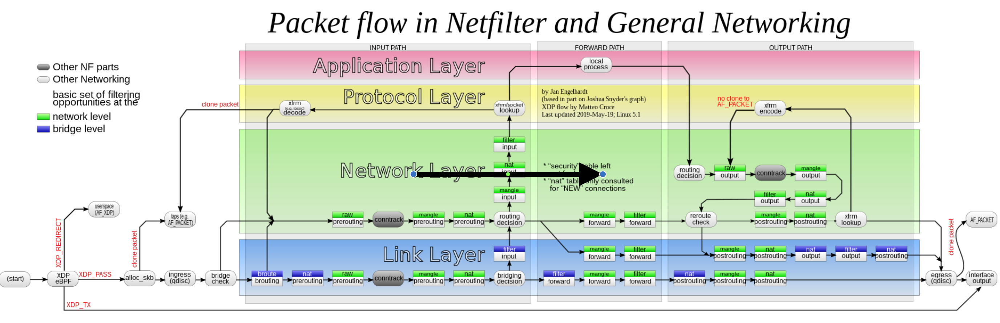

[练习3](https://github.com/eric-keller/npp-linux-03-gateway/)


## 数据包的过滤

- 数据过滤
- 地址转换
- - 静态地址转换： 
- - 动态地址转换:  
- - port forward

```sh
iptables (ADD/REM/CHANGE) (TABLE) (CHAIN) (RULE)
```
- table: filter,nat,mangle,raw
- CHAIN: 每个表包含内置的CHAIN，也可以自定义CHAIN。CHAIN对应处理数据包的Hook。
- RULE: (Match:Action)
```sh
# 常见的Match
-p, --protocol [!] protocol
-s, --source [!] ip[/mask]
-d, --destination [!] ip[/mask] 
-i, --in-interface [!] name
-o, --out-interface [!] name

# 扩展规则
# A.比如 -p tcp ，会多出以下两个规则 
# --destination-port [!] port[:port], 
# --tcp-flags [!] mask comp    

#  eg: -p tcp --destination-port 80
#  eg: -p tcp --tcp-flags   SYN,ACK,FIN,RST SYN


# B -m [module] or --match [module]
# eg: -m conntrack --ctstate ESTABLISHED,RELATED

```
```sh
# 常见的ACTION
-j  ACCEPT
-j  DROP
-j  RETURN

# 扩展ACTION

#1.拒绝，并且回复 端口不可到达的icmp消息
-j REJECT --reject-with icmp-port-unreachable
# 2.日志追加
-j LOG --log-level 4 --log-prefix ’IPTABLES LOG:’

# 3.把数据包的 dest ip 修改 为：
-j DNAT --to-destination 192.168.1.2

# 4..把数据包的 src ip 自动修改(伪装) ：
-j MASQUERADE

# 5.把数据包的 src ip 修改 为：
-j SNAT --to-source 

# 6.
# SET

```

## 负载均衡

## Qos

