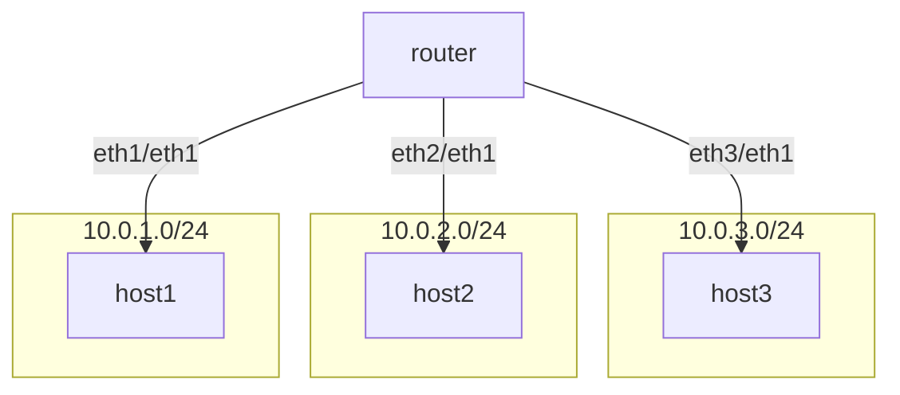

[练习2](https://github.com/eric-keller/npp-linux-02-router)

## 静态路由的配置


```sh
# 3个host 添加ip
lan1 ip addr add 10.0.1.2 dev eth1
lan2 ip addr add 10.0.2.2 dev eth1
lan3 ip addr add 10.0.3.2 dev eth1

# router为3个接口添加ip
rtr ip addr add 10.0.1.1 dev eth1
rtr ip addr add 10.0.2.1 dev eth2
rtr ip addr add 10.0.3.1 dev eth3

#  3个host 都是通过各自eth1 访问 10.0.0.0/16
lan1 ip route add 10.0.0.0/16 dev eth1
lan2 ip route add 10.0.0.0/16 dev eth1
lan3 ip route add 10.0.0.0/16 dev eth1

# router 上配置 
#   1.0=>eth1，2.0=>eth2，3.0=>eth3
rtr ip route add 10.0.1.0/24 dev eth1
rtr ip route add 10.0.2.0/24 dev eth2
rtr ip route add 10.0.3.0/24 dev eth3

```

<font color=red>以上配置有问题，原因是 当host1 ping host2的 时候，他会在eth1上发送arp请求host2的mac,arp请求到router后，发现找不到host2的ip,无法应答！</font>

<font color=pink>注意arp包到了router,不会被转发给eth2,eth3,因为不是ip协议，根本不会参考路由表！</font>


```sh
# 3个host 添加ip
lan1 ip addr add 10.0.1.2 dev eth1
lan2 ip addr add 10.0.2.2 dev eth1
lan3 ip addr add 10.0.3.2 dev eth1

# router为3个接口添加ip
rtr ip addr add 10.0.1.1 dev eth1
rtr ip addr add 10.0.2.1 dev eth2
rtr ip addr add 10.0.3.1 dev eth3

#配置 每个host的网关， 从eth1发出的arp请求包会直接到 网关，所以网关会给出arp应答
lan1 ip route add 10.0.1.1/32 dev eth1 
lan2 ip route add 10.0.2.1/32 dev eth1 
lan3 ip route add 10.0.3.1/32 dev eth1 

#  3个host 都是通过各自eth1 访问 10.0.0.0/16,下一跳mac地址是网关 
lan1 ip route add 10.0.0.0/16 dev eth1 via 10.0.1.1
lan2 ip route add 10.0.0.0/16 dev eth1 via 10.0.2.1
lan3 ip route add 10.0.0.0/16 dev eth1 via 10.0.3.1

# router 上配置 
#   1.0=>eth1，2.0=>eth2，3.0=>eth3
rtr ip route add 10.0.1.0/24 dev eth1
rtr ip route add 10.0.2.0/24 dev eth2
rtr ip route add 10.0.3.0/24 dev eth3


# 查看 arp表
lan1 ip neigh
lan1 ip neigh flush all
```


### gre的支持
GRE (Generic Routing Encapsulation) 是一种隧道协议，用于在两个网络节点之间封装数据包。它允许在不同的网络协议之间传输数据，并且可以在公共网络上创建虚拟点对点连接。GRE 隧道的实现步骤如下：

1. **创建隧道接口**：使用 `ip tunnel add` 命令创建 GRE 隧道接口，指定本地和远程 IP 地址以及 TTL（生存时间）。
2. **配置隧道接口 IP 地址**：为 GRE 隧道接口分配 IP 地址。
3. **启用隧道接口**：使用 `ip link set` 命令启用 GRE 隧道接口。

GRE 协议的主要功能包括：
- **封装多种协议**：能够封装多种网络层协议，如 IPv4、IPv6 等。
- **跨越不同网络**：在不同的网络之间传输数据包，支持跨越公共网络。
- **虚拟专用网络**：创建虚拟点对点连接，实现虚拟专用网络（VPN）的功能。


以下是 GRE 隧道的配置示例：

```sh
lan1 ip tunnel add gre1 mode gre local 10.0.1.2  remote 10.0.3.2 ttl 255
lan1 ip addr add 192.168.0.100/30 dev gre
lan1 ip link set gre1 up


lan3 ip tunnel add gre1 mode gre local 10.0.3.2 remote 10.0.1.2 ttl 255
lan3 ip addr add 192.168.0.101/30 dev gre
lan3 ip link set gre1 up
```

## 动态路由

### 网络的控制平面和数据平面

在计算机网络中，控制平面（Control Plane）和数据平面（Data Plane）是两个关键的概念，它们分别负责不同的网络功能。

#### 控制平面（Control Plane）
控制平面负责网络设备之间的通信和路由信息的交换。它主要包括以下功能：
- **路由选择**：通过路由协议（如 OSPF、BGP 等）计算最佳路径，并生成路由表（RIB，Routing Information Base）。
- **网络拓扑发现**：通过协议交换信息，了解整个网络的拓扑结构。
- **策略应用**：根据网络策略，决定数据包的转发路径。

#### 数据平面（Data Plane）
数据平面负责实际的数据包转发和处理。它主要包括以下功能：
- **数据包转发**：根据转发表（FIB，Forwarding Information Base），将数据包从输入接口转发到输出接口。
- **数据包处理**：执行数据包的检查、修改和转发等操作。


### 自治系统（AS）和边界网关协议（BGP）

#### 自治系统（AS）
自治系统（Autonomous System，AS）是指在单一技术管理下的一组 IP 网络和路由器，通常由一个或多个网络运营商或组织管理。每个 AS 都有一个唯一的 AS 号（ASN），用于在 BGP 路由选择过程中标识和区分不同的自治系统。

AS 的主要特点包括：
- **单一管理**：由一个组织或网络运营商管理。
- **统一路由策略**：在 AS 内部使用统一的路由策略和协议（如 OSPF、EIGRP 等）。
- **对外路由信息发布**：通过 BGP 协议与其他 AS 交换路由信息。

#### 边界网关协议（BGP）
边界网关协议（Border Gateway Protocol，BGP）是一种用于在不同自治系统之间交换路由信息的外部网关协议（EGP）。BGP 是互联网的主要路由协议，负责在全球范围内传播路由信息。

BGP 的主要功能和特点包括：
- **路径向量协议**：BGP 使用路径向量算法，通过 AS 路径属性选择最佳路由。
- **路由选择**：BGP 根据多个属性（如 AS 路径、下一跳、路由优先级等）选择最佳路由。
- **策略控制**：BGP 允许网络管理员根据策略控制路由信息的传播和选择。
- **可靠传输**：BGP 使用 TCP（端口 179）进行可靠的路由信息传输。

以下是 BGP 配置的基本步骤：
1. **配置 BGP 进程**：在路由器上启用 BGP 并指定本地 AS 号。
2. **建立 BGP 邻居关系**：配置与其他 AS 的 BGP 邻居关系，交换路由信息。
3. **发布网络**：通过 BGP 发布本地网络前缀，使其在其他 AS 中可达。
4. **应用策略**：根据需要配置路由策略，控制路由信息的传播和选择。
