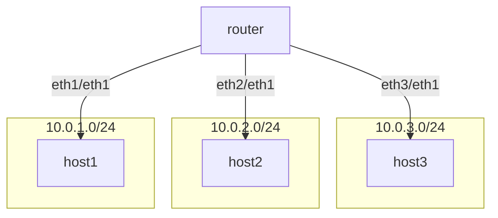

[练习2](https://github.com/eric-keller/npp-linux-02-router)



```sh
# 3个host 添加ip
lan1 ip addr add 10.0.1.2 dev eth1
lan2 ip addr add 10.0.2.2 dev eth1
lan3 ip addr add 10.0.3.2 dev eth1

# router为3个接口添加ip
rtr ip addr add 10.0.1.1 dev eth1
rtr ip addr add 10.0.2.1 dev eth2
rtr ip addr add 10.0.3.1 dev eth3

#  3个host 都是通过各自eth1 访问 10.0.0.0/16
lan1 ip route add 10.0.0.0/16 dev eth1
lan2 ip route add 10.0.0.0/16 dev eth1
lan3 ip route add 10.0.0.0/16 dev eth1

# router 上配置 
#   1.0=>eth1，2.0=>eth2，3.0=>eth3
rtr ip route add 10.0.1.0/24 dev eth1
rtr ip route add 10.0.2.0/24 dev eth2
rtr ip route add 10.0.3.0/24 dev eth3

```

<font color=red>以上配置有问题，原因是 当host1 ping host2的 时候，他会在eth1上发送arp请求host2的mac,arp请求到router后，发现找不到host2的ip,无法应答！</font>

<font color=pink>注意arp包到了router,不会被转发给eth2,eth3,因为不是ip协议，根本不会参考路由表！</font>


```sh
# 3个host 添加ip
lan1 ip addr add 10.0.1.2 dev eth1
lan2 ip addr add 10.0.2.2 dev eth1
lan3 ip addr add 10.0.3.2 dev eth1

# router为3个接口添加ip
rtr ip addr add 10.0.1.1 dev eth1
rtr ip addr add 10.0.2.1 dev eth2
rtr ip addr add 10.0.3.1 dev eth3

#配置 每个host的网关， 从eth1发出的arp请求包会直接到 网关，所以网关会给出arp应答
lan1 ip route add 10.0.1.1/32 dev eth1 
lan2 ip route add 10.0.2.1/32 dev eth1 
lan3 ip route add 10.0.3.1/32 dev eth1 

#  3个host 都是通过各自eth1 访问 10.0.0.0/16,下一跳mac地址是网关 
lan1 ip route add 10.0.0.0/16 dev eth1 via 10.0.1.1
lan2 ip route add 10.0.0.0/16 dev eth1 via 10.0.2.1
lan3 ip route add 10.0.0.0/16 dev eth1 via 10.0.3.1

# router 上配置 
#   1.0=>eth1，2.0=>eth2，3.0=>eth3
rtr ip route add 10.0.1.0/24 dev eth1
rtr ip route add 10.0.2.0/24 dev eth2
rtr ip route add 10.0.3.0/24 dev eth3


# 查看 arp表
lan1 ip neigh
lan1 ip neigh flush all
```


### gre的支持
GRE (Generic Routing Encapsulation) 是一种隧道协议，用于在两个网络节点之间封装数据包。它允许在不同的网络协议之间传输数据，并且可以在公共网络上创建虚拟点对点连接。GRE 隧道的实现步骤如下：

1. **创建隧道接口**：使用 `ip tunnel add` 命令创建 GRE 隧道接口，指定本地和远程 IP 地址以及 TTL（生存时间）。
2. **配置隧道接口 IP 地址**：为 GRE 隧道接口分配 IP 地址。
3. **启用隧道接口**：使用 `ip link set` 命令启用 GRE 隧道接口。

GRE 协议的主要功能包括：
- **封装多种协议**：能够封装多种网络层协议，如 IPv4、IPv6 等。
- **跨越不同网络**：在不同的网络之间传输数据包，支持跨越公共网络。
- **虚拟专用网络**：创建虚拟点对点连接，实现虚拟专用网络（VPN）的功能。


以下是 GRE 隧道的配置示例：

```sh
lan1 ip tunnel add gre1 mode gre local 10.0.1.2  remote 10.0.3.2 ttl 255
lan1 ip addr add 192.168.0.100/30 dev gre
lan1 ip link set gre1 up


lan3 ip tunnel add gre1 mode gre local 10.0.3.2 remote 10.0.1.2 ttl 255
lan3 ip addr add 192.168.0.101/30 dev gre
lan3 ip link set gre1 up
```