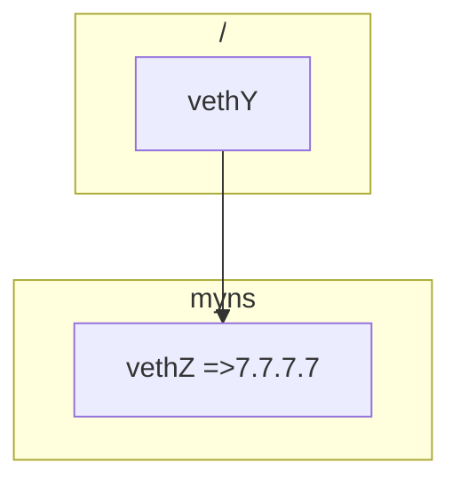
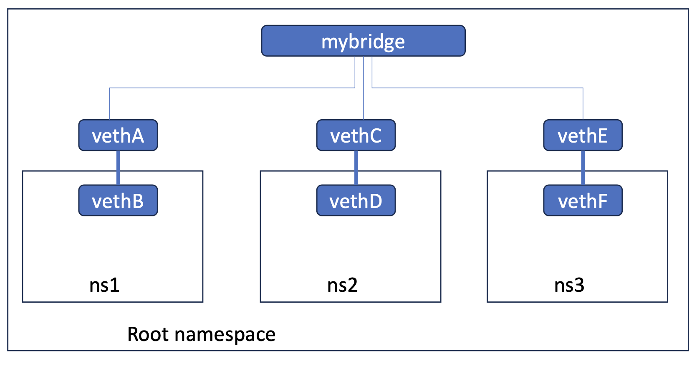

[练习4](https://github.com/eric-keller/npp-linux-04-virtual)

## NameSpace
- 只要用于区分 进程
## Control Group(CGroup)
- 主要用于控制进程的 cpu/mem 使用量
## Veth
- <font color=red>成对创建,从一端发送的数据包另外一端马上会收到！</font>
- 加入对应的命名空间



```sh
# 1.添加命名空间，2.创建一对veth,3.设备管理命名空间
ip netns add myns
ip link add vethY type veth peer name vethZ
ip link set vethZ netns myns

# 查看命令
ip netns 
apt install ethtool
# 发现peer device的 id
ethtool -S vethY


ip -n myns link 
# 默认会添加7.7.7.0的路由
ip -n myns addr add 7.7.7.7/24 dev vethZ
ip -n myns link set vethZ up 
# 加入默认路由
ip -n myns route add 0.0.0.0/0 dev vethZ


ip link set vethY up


# 测试 是不是从vethZ 发的数据包 vethY可以收到

ip netns exec myns ping 6.6.6.6
tcpdump -i vethY -n


# 测试能否正常回复数据
# 设备vethY上 收到arp数据包 查找6.6.6.6  mac地址
# 我可以设置本机任意一个设备的ip是6.6.6.6,不一定非要是vethY
ip addr add 6.6.6.6/24 dev <any dev>
# 设置路由表，指明7.7.7.7的 路由需要 从vethY
ip route add 7.7.7.0/24 dev vethY
```

其他命令 
```sh
# 设备 移出命令空间，1代表 /命名空间
ip netns exec myns ip link set vethZ netns 1
```



- 链路层构建
```sh

ip netns add ns1
ip netns add ns2
ip netns add ns3

ip link add vethA type veth peer name vethB
ip link add vethC type veth peer name vethD
ip link add vethE type veth peer name vethF


ip link set vethB netns ns1
ip link set vethD netns ns2
ip link set vethF netns ns3


ip link set vethA up
ip link set vethC up
ip link set vethE up

ip -n ns1 link set vethB up
ip -n ns2 link set vethD up
ip -n ns3 link set vethF up


ip link add name mybridge type bridge
ip link set mybridge up
ip link set vethA master mybridge
ip link set vethC master mybridge
ip link set vethE master mybridge
```
- ns1,ns2,ns3互通
```sh
iptable -F
ip -n ns1 addr add 192.168.10.2/24 dev vethB

# 验证下 ns2,ns3都能收到arp 消息
ip netns exec ns1 ping -c 4 192.168.10.3
ip netns exec ns2 tcpdump -i vethD -n -l
ip netns exec ns3 tcpdump -i vethF -n -l

ip -n ns2 addr add 192.168.10.3/24 dev vethD
ip -n ns3 addr add 192.168.10.4/24 dev vethF


# 清理
# ip netns delete ns1
# ip netns delete ns2
# ip netns delete ns3
# ip link delete mybridge
```
- namespace <==> host
```sh
ip -n ns1 route add default via 192.168.10.1
ip -n ns2 route add default via 192.168.10.1
ip -n ns3 route add default via 192.168.10.1

# 注意，这条命令2个作用
# 1。给 mybridge 添加ip:  
#       ip addr add dev mybridge 192.168.10.1
# 2.设置路由表，如何 到达192.168.10.0/24的网络  
#       ip route add 192.168.10.0/24 dev mybridge
ip addr add dev mybridge 192.168.10.1/24

# 这样主机 与 namespace可以互 ping
```
- namespace ==> 局域网

```sh

# 这个命令很奇怪， 出网的时候 把 namespace里面的ip 地址替换成 192.168.1.126
# 入网的时候 还能把 192.168.1.126 替代会 namespace里面的ip
iptables -t nat -I POSTROUTING 1 -o eno1 -s 192.168.10.0/24 -j SNAT --to-source 192.168.1.126

# 以下命令是 上面的简化，不用手动指定要替换后的 ip了
iptables -t nat -I POSTROUTING 1 -o eno1 -s 192.168.10.0/24 -j MASQUERADE
```

- 局域网 ==> namespace
```sh
# 使用port forward技术
ip netns exec ns2 nc -l 9999
# 只有DNAT 会修改数据包的 目标ip,port
iptables -t nat -I PREROUTING 1 -p tcp --dport 9999 -j DNAT --to-destination 192.168.10.3:9999
```

## Docker网络
```sh
# 重现 docker创建的命名空间
touch /var/run/netns/$container_name
pid=$(sudo docker inspect -f '{{.State.Pid}}' $container_name)
mount -o bind /proc/$pid/ns/net /var/run/netns/$container_name

# 容器内查看对端的 设备
ip netns exec ethtool -S eth0
# host 查看,记录下master bridge 
ip link 
```