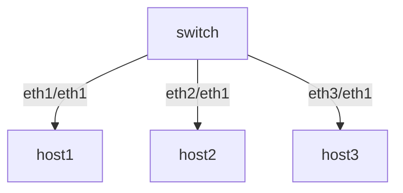
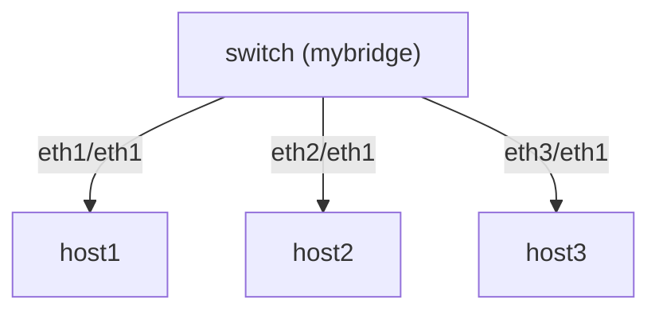
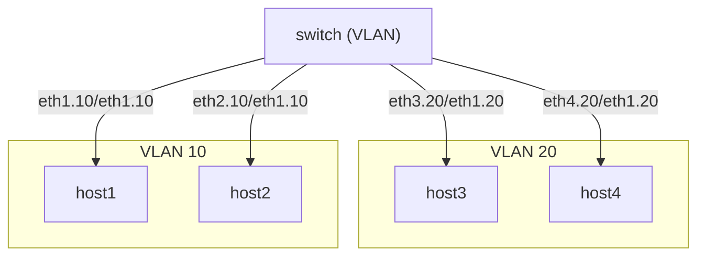

[练习1](https://github.com/eric-keller/npp-linux-01-intro/)

- 假设网络的拓扑结构如下：



```sh
#如果让 switch 与host1 连同，需要 给 swtch和 host1都配置好ip
ip addr add 192.168.1.1/24 dev eth1  #switch
ip addr add 192.168.1.2/24 dev eth1  #host1

# 但是swtch与host2如何联通？host1与 host2如何联通呢？
# 以下可以，但是 host1与host2就不同 网段了
ip addr add 192.168.2.1/24 dev eth2  #switch
ip addr add 192.168.2.1/24 dev eth1  #host2


```


- <font color=gree>在switch上配置bridge,解决以上问题</font>

```sh
# switch 

ip link add name mybridge type bridge
ip link set mybridge up
ip link set eth1 master mybridge
ip link set eth2 master mybridge
ip link set eth3 master mybridge
ip addr add 192.168.1.1/24 dev mybridge

ip addr add 192.168.1.2/24 dev eth1  #host1
ip addr add 192.168.1.3/24 dev eth1  #host2
ip addr add 192.168.1.4/24 dev eth1  #host3


```


tshark 的使用说明

```sh

-f <capture filter>. 设置抓包 过滤
-Y <display filter>. 设置抓包后显示 过滤

eg:
tshark -i eth1 -f “host 1.2.3.4 and port 80”
tshark -Y "tcp.port == 80“
tshark -i eth1

tshark -O <proto>  只显示某个协议的内容
```

[ip link 的使用说明](https://manpages.ubuntu.com/manpages/xenial/man8/ip-link.8.html)
```sh
ip link show eth0 
ip link show up
ip link show type bridge
```
## 常见的设备类型

### Physical interfaces
### Bridge


### VLAN

VLAN (Virtual Local Area Network) 是一种将物理网络划分为多个逻辑网络的技术。通过VLAN，可以将一个物理网络中的设备划分为多个逻辑子网，从而实现网络隔离、提高网络安全性和管理效率。


#### VLAN的配置

在配置VLAN时，需要在交换机上创建VLAN，并将相应的端口分配到对应的VLAN中。以下是一个简单的VLAN配置示例：

```sh
# 创建VLAN 10
ip link add link eth0 name eth0.10 type vlan id 10
ip link set eth0.10 up

# 创建VLAN 20
ip link add link eth0 name eth0.20 type vlan id 20
ip link set eth0.20 up
```





```sh
# 实现上图的拓扑

# 在4台host创建vlan接口， h1,h2一组，h3,h4一组
h1 ip link add link eth1 name eth1.10 type vlan id 10
h2 ip link add link eth1 name eth1.10 type vlan id 10
h3 ip link add link eth1 name eth1.20 type vlan id 20
h4 ip link add link eth1 name eth1.20 type vlan id 20
# 启动
h1 ip link set eth1.10 up
h2 ip link set eth1.10 up
h3 ip link set eth1.20 up
h4 ip link set eth1.20 up

#交换机上创建 对应的接口
sw ip link add link eth1 name eth1.10 type vlan id 10
sw ip link add link eth2 name eth2.10 type vlan id 10
sw ip link add link eth3 name eth3.20 type vlan id 20
sw ip link add link eth4 name eth4.20 type vlan id 20

#启动
sw ip link set eth1.10 up
sw ip link set eth2.10 up
sw ip link set eth3.20 up
sw ip link set eth4.20 up

sw ip link show type vlan

# host1,host2对应的 节点连到br10
sw ip link add name br10 type bridge
sw ip link set eth1.10 master br10
sw ip link set eth2.10 master br10

# host3,host4对应的 节点连到br20
sw ip link add name br20 type bridge
sw ip link set eth3.20 master br20
sw ip link set eth4.20 master br20

#启动bridge
sw ip link set br10 up
sw ip link set br20 up


sw ip link show master br10
sw ip link show master br20
# 测试
shark -T fields -e eth -e vlan -i eth1
python3 /lab-folder/onepkt.py 22:11:11:11:11:11 22:22:22:22:22:22 eth1.10 123

```
### Virtual devices – (veth)
